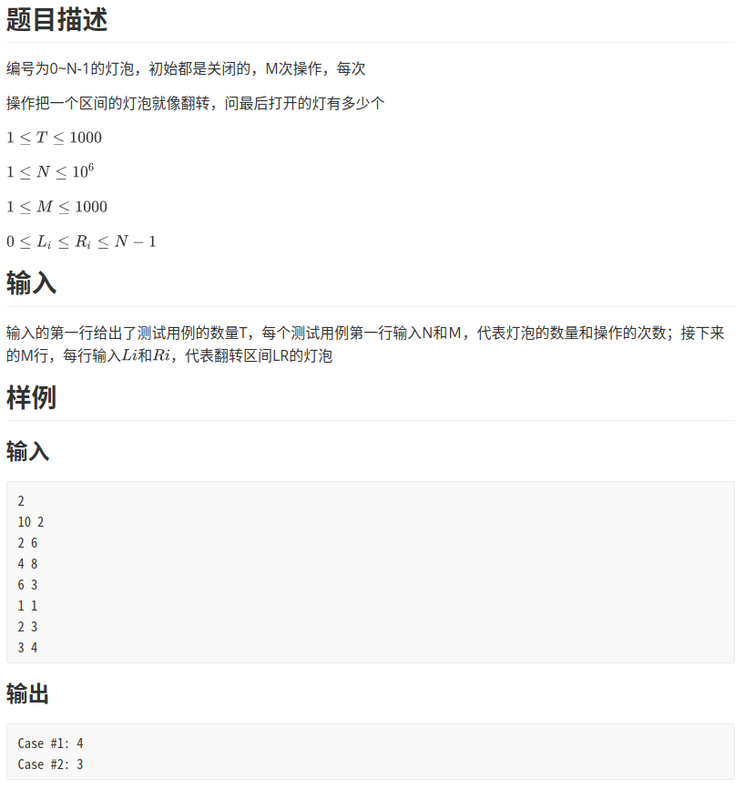
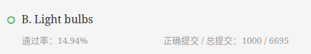

上海站Ｂ题Light bulbs
<!-- more -->

# [上海站Ｂ题Light bulbs](https://nanti.jisuanke.com/t/41399)



# 题解

签到题



- 排序
- 前缀和
- 差分

*注意此题卡时间又卡空间，单纯普通类型一维数组长度不能超过1e6*

---
## 前缀和
### 定义
前缀和是一种重要的预处理，能大大降低查询的时间复杂度。我们可以简单理解为
"数列的前n项的和"
### 通式
给定一个数组A[1..n]，前缀和数组PrefixSum[1..n]定义为：
PrefixSum[i] = A[0]+A[1]+...+A[i-1]；
**举例**
A[5,6,7,8] --> PrefixSum[5,11,18,26]

PrefixSum[0] =A[0] ;
PrefixSum[1] =A[0] + A[1] ;
PrefixSum[2] =A[0] + A[1] + A[2] ;
PrefixSum[3] =A[0] + A[1] + A[2] + A[3] ;

## 差分

### 定义

**差分就是将数列中的每一项分别与前一项数做差**，例如：
一个序列1 2 5 4 7 3，差分后得到1 1 3 -1 3 -4 -3

注意：
- 得到的差分序列第一个数和原来的第一个数一样（相当于第一个数减0）
- 差分序列最后比原序列多一个数（相当于0减最后一个数）

### 性质（省去证明）
①差分序列求前缀和可得原序列；

②原序列区间[L,R]中的元素全部+K，可以转化操作为差分序列L处+K，R+1处-K；

## 解题
- 我们可以对题意进行转换

    **n个点m个区间，每次区间内的数+1，求最后n个点中计数为奇数的点的个数**。
    **这个就是经典的差分问题**

- 因为n比较大，所以我们可以对m入手，存储所有操作区间的端点，所以下面操作的都是被操作后的区间，而不是所有的值。
    **如果不对区间操作，序列中每个原始的值可以为0，代表是暗的，那么差分序列的值全是0；对区间[L,R]+1，等于L处+1，R+1处-1；操作完成后，这时候求前缀和正好对应的是操作次数。)**

```c++
/**
 * 359ms	256kB     c++14
 */
#include<iostream>
#include<cstring>
#include<cstdio>
#include<cmath>
#include<algorithm>
using namespace std;

//左侧代表端点，右侧代表操作
pair<int,int>p[2020];

int main()
{
	int t1,t,n,m,l,r;
	scanf("%d",&t1);
	for(int k=1;k<=t1;k++)
    {
		int tot=0;
		scanf("%d%d",&n,&m);
		for(int i=0;i<m;i++)
		{
			scanf("%d%d",&l,&r);
			p[tot++]=make_pair(l,1);
			p[tot++]=make_pair(r+1,-1);
		}
		sort(p,p+tot);
		//now表示当前的位置
		//sum表示从now到当前灯泡的开关状态
		int sum=0,now=0,ans=0;
		for(int i=0;i<tot;i++)
		{
		    //不重叠
			if(now!=p[i].first)
			{
				if(sum % 2 != 0)
				{
					ans+=p[i].first-now;
				}
				now=p[i].first;
			}
			sum+=p[i].second;
		}
		printf("Case #%d: %d\n",k,ans);
	}
	return 0;
}
```
