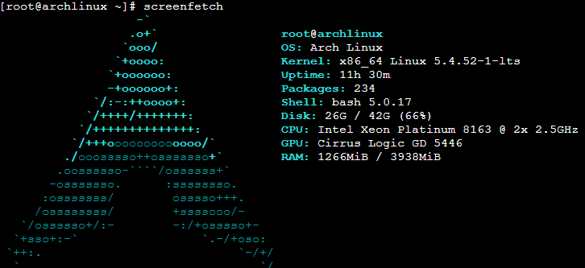
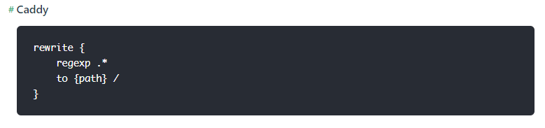

Caddy2在vue-history模式下的配置

<!-- more -->

# Caddy是什么

Caddy是一个像`Apache`，`Nginx`的web服务器

在使用了web服务器的网站中，有30%+使用了Nginx，是市面上使用最广泛的web服务器之一

**对于个人开发者来说**，Caddy可能是你的较好选择，在市面上Caddy占有额会非常的微小，但是它方便的配置就足够了

# Caddy2

Caddy的最新版本是2.x， 功能强大了很多，但是资料/dome 都比较少，这里记录一下使用过程，下面是一些Caddy2的参考资料：

https://caddyserver.com/v2

https://caddyserver.com/docs/caddyfile/directives

https://github.com/caddyserver/caddy/wiki

https://caddy.community/

# 配置机器



# 安装Caddy2

下载地址：https://github.com/caddyserver/caddy/releases

这里下的是https://github.com/caddyserver/caddy/releases/download/v2.1.1/caddy_2.1.1_linux_amd64.tar.gz

下载后解压

```shell
tar -xvf caddy_2.1.1_linux_amd64.tar.xz
```

移动到`/usr/local/bin`

```shell
mv caddy /usr/local/bin
```

输入命令显示v2.1.1版本号证明安装完成

```shell
caddy version
```

# 配置systemctl

用systemctl管理Caddy2比较方便，方便开机自启，reload新的配置

```shell
# vim /lib/systemd/system/caddy.service
[Unit]
Description=Caddy
Documentation=https://caddyserver.com/docs/
After=network.target

[Service]
ExecStart=/usr/local/bin/caddy run --environ --config /usr/local/bin/Caddyfile
ExecReload=/usr/local/bin/caddy reload --config /usr/local/bin/Caddyfile
TimeoutStopSec=5s
LimitNOFILE=1048576
LimitNPROC=512
PrivateTmp=true
ProtectSystem=full
AmbientCapabilities=CAP_NET_BIND_SERVICE

[Install]
WantedBy=multi-user.target
```

注意这里我把Caddy的配置文件Caddyfile也放到了`/usr/local/bin`

接着就可以使用`systemctl`一系列操作了

- 开启

  ```shell
  systemctl start caddy
  ```

- 重启

  ```shell
  systemctl restart caddy
  ```

- 开机自启

  ```shell
  systemctl enable caddy
  ```

- 关闭开机自启

  ```shell
  systemctl disable caddy
  ```

- 停止

  ```
  systemctl stop caddy
  ```

# 配合vue-router history模式

[HTML5 History 模式 | Vue Router](https://router.vuejs.org/zh/guide/essentials/history-mode.html)

官方这里给出的Caddy配置是Caddy1的，但是Caddy2的配置和Caddy1的不一样



---

下面是Caddy2的操作

- 打包vue项目，得到dist文件夹

  ```shell
  npm run build
  ```

- 编辑Caddyfile

  ```shell
  :12345 {
          root * /root/gluten/dist
          file_server
          encode zstd gzip
          try_files {path}  /index.html
          log {
                  output file /root/gluten/caddy_log
                  format single_field common_log
          }
  }
  ```

  这里需要注意几点：

  - 配置后使用`localhost:12345`就可以打开网页，使用的是http
  - vue-router history模式Caddy1的`rewrite`在Caddy中应该用`try_files`，配置不对的话出现的问题可能有打开页面404，刷新页面404或者空白

- 重新加载配置

  ```shell
  systemctl restart caddy
  ```

参考：

https://amattn.com/p/vuejs_vue-routers_history_mode_and_caddy2.html

https://caddy.community/t/rewrite-rule-for-vue-apps-in-caddy-v2/8438

# 后记

Caddy2的参考资料还少，需要不断查找资料

希望此篇文章能帮到你