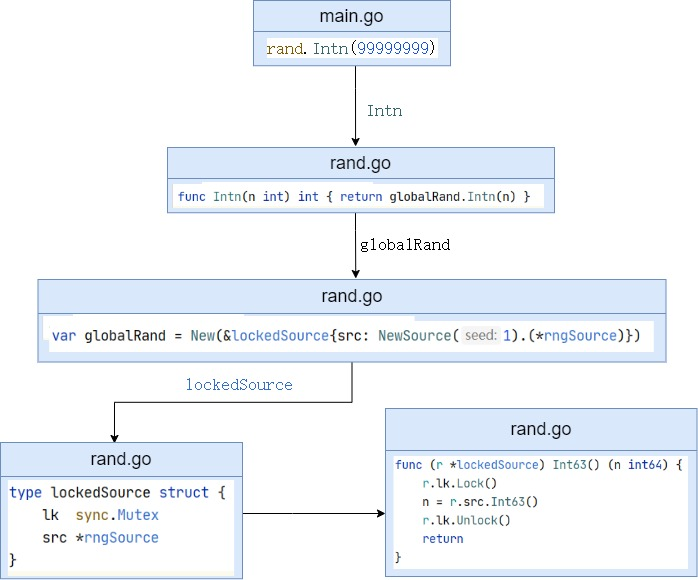
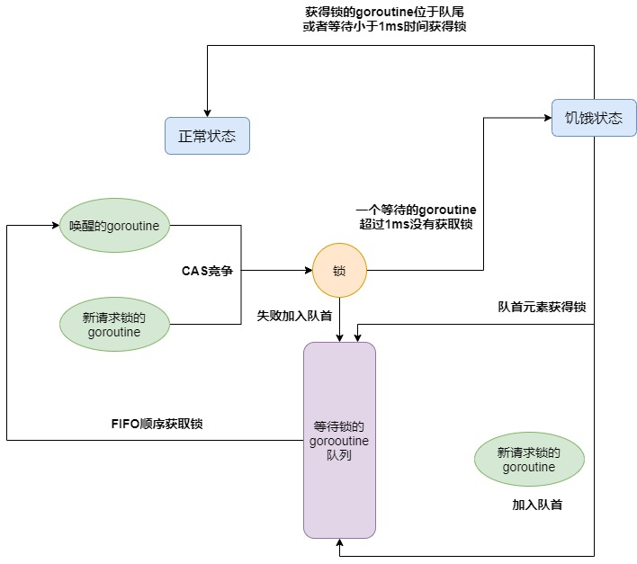
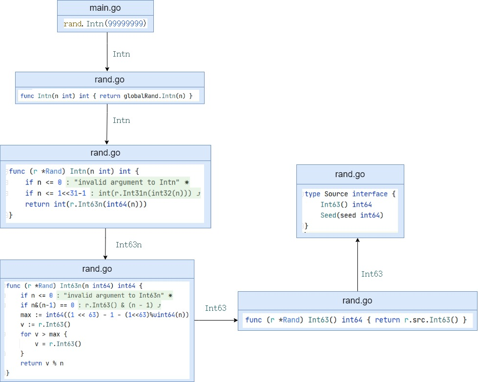

优化大量生成手机号码所使用的时间，取得较好的成果

<!-- more -->

# 随机字符串生成前景

以下省略计算时间的代码

```go
func main()  {
	before := time.Now()
	fmt.Println(before.Format("2006-01-02 15:04:05"))

	//...

	after := time.Now()
	fmt.Println(after.Format("2006-01-02 15:04:05"))
	fmt.Println(after.Sub(before))
}
```

## 单纯跑十亿次循环

```go
idx := 0
for i := 0; i < 1000000000; i++{
    idx++
}

//2020-09-14 15:01:22
//2020-09-14 15:01:22
//232.3817ms
```

## 十亿次随机获取手机号码

```go
var headerNums = [...]string{"139", "138", "137", "136", "135", "134", "159", "158", "157", "150", "151", "152", "188", "187", "182", "183", "184", "178", "130", "131", "132", "156", "155", "186", "185", "176", "133", "153", "189", "180", "181", "177"}
var headerNumsLen = len(headerNums)

func randomPhone() string {
	header := headerNums[rand.Intn(headerNumsLen)]
	body := fmt.Sprintf("%08d", rand.Intn(99999999))
	phone := header + body
	return phone
}

func main(){
    rand.Seed(time.Now().UTC().UnixNano())
	for i := 0; i < 1000000000; i++{
		randomPhone()
	}
}

//2020-09-14 15:08:08
//2020-09-14 15:11:05
//2m56.9453851s
```

可以看到时间差不多花在了生成随机数那里

## 协程

```go
var wg sync.WaitGroup
for i := 0; i < 10; i++{
    wg.Add(1)
    go func() {
        for i := 0; i < 100000000; i++{
            randomPhone()
        }
        defer wg.Done()
    }()
}
wg.Wait()

//2020-09-14 17:21:15
//2020-09-14 17:25:40
//4m25.289406s
```

可以明显看到时间花长了，这一部分应该是`rand`内部有互斥锁的原因，并发情况下竞争锁



`sync.mutex`锁的过程大概如下：



有两种状态：

- 正常状态：等待锁的goroutine按照FIFO的顺序获得锁，如有新请求的锁，则与被唤醒的竞争锁，失败则加入队首，如果一个等待的goroutine超过1ms没有获取锁，那么它将会把锁转变为饥饿模式。
- 饥饿状态：把锁交给等待队列中的第一个（已经unlock状态），新来的goroutine将不会尝试去获得锁，即使锁看起来是unlock状态, 也不会去尝试自旋操作，而是放在等待队列的尾部。

## 协程改进

既然那么多个goroutine会竞争锁，所以我们可以给每个goroutine开一把锁，也就是多个rand实例，那么就不用竞争锁了

```go
package main

import (
	"fmt"
	"math/rand"
	"runtime"
	"sync"
	"time"
)
var headerNums = [...]string{"139", "138", "137", "136", "135", "134", "159", "158", "157", "150", "151", "152", "188", "187", "182", "183", "184", "178", "130", "131", "132", "156", "155", "186", "185", "176", "133", "153", "189", "180", "181", "177"}
var headerNumsLen = len(headerNums)

func randomPhone(generator *rand.Rand) string {
	header := headerNums[generator.Intn(headerNumsLen)]
	body := fmt.Sprintf("%08d", generator.Intn(99999999))
	phone := header + body
	return phone
}

func main()  {
	before := time.Now()
	fmt.Println(before.Format("2006-01-02 15:04:05"))

	var wg sync.WaitGroup
	nCPU := runtime.NumCPU()
	runtime.GOMAXPROCS(nCPU)

	loop := 1000000000 / nCPU
	
	for i := 0; i < nCPU; i++{
        //避免种子一样，生成的随机数也一样
		generator := rand.New(rand.NewSource(time.Now().UnixNano() + int64(i*1000)))
		wg.Add(1)
		go func(generator *rand.Rand) {
			for j := 0; j < loop; j++{
				randomPhone(generator)
			}
			defer wg.Done()
		}(generator)
	}
	wg.Wait()

	after := time.Now()
	fmt.Println(after.Format("2006-01-02 15:04:05"))
	fmt.Println(after.Sub(before))
}
//2020-09-15 22:23:09
//2020-09-15 22:23:38
//28.8154403s
```

# 改善字符串生成的方法

## rand.Intn



可以看到，`rand.Intn`函数最终会调用`Rand.Int63`，所以我们可以直接调用该函数即可

## 利用掩码提高效率

我们现在有10个数字，10用二进制表示就是`1010`，所以我们可以只使用`Rand.Int63()`返回最低的4位数就可以。为了保证平均，如果返回的只大于`len(letterBytes)-1`，则舍弃不用

`Rand.Int63`可以生成63个随机位的数，所以剩下的位数我们依旧可以使用

```go
const letterBytes = "0123456789"
var src = rand.NewSource(time.Now().UnixNano())

var headerNums = [...]string{"139", "138", "137", "136", "135", "134", "159", "158", "157", "150", "151", "152", "188", "187", "182", "183", "184", "178", "130", "131", "132", "156", "155", "186", "185", "176", "133", "153", "189", "180", "181", "177"}
var headerNumsLen = len(headerNums)

const (
    //使用四位二进制即可随机选择letterBytes里面的一位
	letterIdxBits = 4
    //掩码，即4个1
	letterIdxMask = 1<<letterIdxBits - 1
)
const (
    //使用六位二进制即可随机选择headerNums里面的一位
	headerIdxBits = 6
	headerIdxMask = 1<<headerIdxBits - 1
)

func getHeaderIdx(cache int64) int {
	for cache > 0{
        //得到掩码对应的位数，比如1010110101 & 111111 = 0000110101
        //这样就可以取出二进制去随机选择数字了
		idx := int(cache & headerIdxMask)
		if idx < headerNumsLen{
			return idx
		}
        //取到的数字超过headerNums的长度，除去后6位，重新选择数字
		cache >>= headerIdxBits
	}
    //否则使用库函数生成
	return rand.Intn(headerNumsLen)
}

func randomPhone() string {
    //12位手机号码
	b := make([]byte, 12)
    //获取一个63位的随机数
	cache := src.Int63()
    //获取选择手机号码前3位的随机数
	headerIdx := getHeaderIdx(cache)
    //使用得到的随机数去获取手机号码前3位
	for i := 0; i < 3; i++{
		b[i] = headerNums[headerIdx][i]
	}
    //继续选择剩下的12位
	for i := 3; i < 12 ; {
        //生成的随机数用完了，重新生成
		if cache == 0{
			cache = src.Int63()
		}
        //和getHeaderIdx一样
		if idx := int(cache & letterIdxMask); idx < len(letterBytes) {
			b[i] = letterBytes[idx]
			i++
		}
		cache >>= letterIdxBits
	}
	return string(b)
}
```

## 使用strings.Builder提升字符串拼接速度（可选）

这个是G0 1.10 新增的功能，提升字符串拼接的效率，`strings.Builder`的原理其实很简单，是内置了一个`[]byte`存储字符，最终转换为`string`的时候为了避免拷贝，使用了`unsafe`包，可以把`string(b)`变为`*(*string)(unsafe.Pointer(&b))`

这里字符串长度比较短，所以影响不大

## 最后的代码

```go
package main

import (
	"fmt"
	"math/rand"
	"time"
)

const letterBytes = "0123456789"
const (
	letterIdxBits = 4
	letterIdxMask = 1<<letterIdxBits - 1
)
var src = rand.NewSource(time.Now().UnixNano())

var headerNums = [...]string{"139", "138", "137", "136", "135", "134", "159", "158", "157", "150", "151", "152", "188", "187", "182", "183", "184", "178", "130", "131", "132", "156", "155", "186", "185", "176", "133", "153", "189", "180", "181", "177"}
var headerNumsLen = len(headerNums)
const (
	headerIdxBits = 6
	headerIdxMask = 1<<headerIdxBits - 1
)

func getHeaderIdx(cache int64) int {
	for cache > 0{
		idx := int(cache & headerIdxMask)
		if idx < headerNumsLen{
			return idx
		}
		cache >>= headerIdxBits
	}
	return rand.Intn(headerNumsLen)
}

func randomPhone() string {
	b := make([]byte, 12)
	cache := src.Int63()
	headerIdx := getHeaderIdx(cache)
	for i := 0; i < 3; i++{
		b[i] = headerNums[headerIdx][i]
	}
	for i := 3; i < 12 ; {
		if cache == 0{
			cache = src.Int63()
		}
		if idx := int(cache & letterIdxMask); idx < len(letterBytes) {
			b[i] = letterBytes[idx]
			i++
		}
		cache >>= letterIdxBits
	}
	return string(b)
}

func main()  {
	before := time.Now()
	fmt.Println(before.Format("2006-01-02 15:04:05"))

	for i := 0; i < 1000000000; i++{
		randomPhone()
	}

	after := time.Now()
	fmt.Println(after.Format("2006-01-02 15:04:05"))
	fmt.Println(after.Sub(before))
}

//2020-09-15 20:44:13
//2020-09-15 20:45:34
//1m21.0054747s
```

速度提升还是很明显的，在配置低的电脑上面差距会更大

如果我们加上协程呢，同时注意去掉`var src = rand.NewSource(time.Now().UnixNano())`避免竞争锁

调用代码和没有使用改善字符串生成的方法差不多

```go
//2020-09-15 22:19:33
//2020-09-15 22:19:45
//11.851417s
```

效果强劲

# 最终成果

- 不开多个协程：`2m56.9453851s >> 1m21.0054747s`

- 开多个协程：`28.8154403s >> 11.851417s ` 

---

参考：

[sync.mutex 源代码分析 | 鸟窝](https://colobu.com/2018/12/18/dive-into-sync-mutex/)

[图解Go里面的互斥锁mutex了解编程语言核心实现源码 - 掘金](https://juejin.im/post/6844904029277913102)

[一步步提升Go语言生成随机字符串的效率 | 飞雪无情的博客](https://www.flysnow.org/2019/09/30/how-to-generate-a-random-string-of-a-fixed-length-in-go.html)