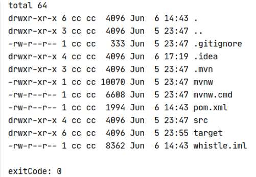
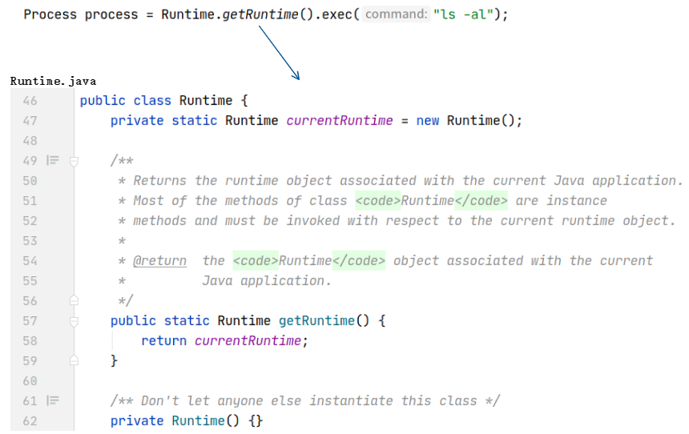
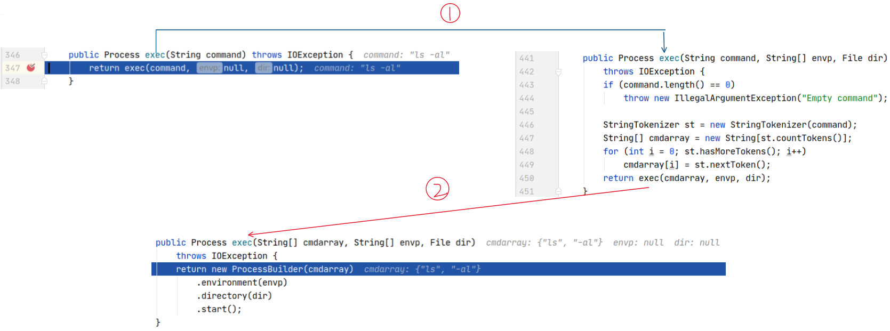
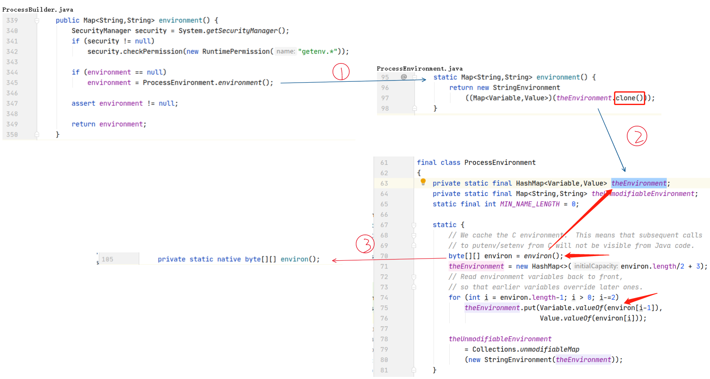
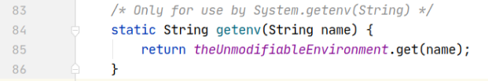

ProcessBuilder类浅析以及Linux Shell执行逻辑

<!-- more -->

从Java代码运行Shell命令有两种方式

- 使用`Runtime`类的`exec`方法
- 第二种是使用`ProcessBuilder`类

使用第二种方法能够定制更多的内容，本文主要介绍的是第二种，第一种介绍下用法

环境约定：

- `Arch Linux x86_64 Linux 5.4.44-1-lts`
- `java version "1.8.0_251" Java HotSpot(TM) 64-Bit Server VM (build 25.251-b08, mixed mode)`

## Runtime

```java
public void runTime() throws IOException, InterruptedException {
    //在单独的进程中执行指定的字符串命令（产生一个新的子进程）
    Process process = Runtime.getRuntime().exec("ls -al");
    //将InputStream中的内容转成字符串
    String s = IoUtil.read(process.getInputStream(), "UTF-8");
    System.out.println(s);
    //使当前线程等待，直到此Process对象表示的进程终止
    //如果子进程已经终止，则此方法立即返回。 如果子进程尚未终止，则调用线程将被阻塞，直到子进程退出
    //在读取输出之后才调用process.waitFor（），因为输出缓冲区可能会使进程停止
    int exitCode = process.waitFor();
    System.out.println("exitCode: " + exitCode);
}
```



一个很简单的例子，执行`ls -al`命令获取项目文件夹下的文件信息

查看源码，在JDK1.0的时候就提供，使用单例模式返回一个Runtime对象



在`exec`方法中，实际最终也是调用了`ProcessBuilder`这个类去执行，所以我们研究`ProcessBuilder即可`



## ProcessBuilder

### 简介

1. 此类用于创建操作系统进程
2. 命令的有效性取决于操作系统
3. 此类**未同步**。 如果多个线程同时访问ProcessBuilder实例，并且至少有一个线程在结构上修改了其中一个属性，则必须在外部对其进行同步

###  简单使用

```java
public void processBuilder() throws IOException, InterruptedException {
    //参数必须以正确的顺序排列
    Process process = new ProcessBuilder("ls", "-al").start();
    String s = IoUtil.read(process.getInputStream(), "UTF-8");
    System.out.println(s);
    int exitCode = process.waitFor();
    System.out.println("exitCode: " + exitCode);
}
```

这里需要注意的是传入的命令是分割后的，格式`new ProcessBuilder("cmd", "arg1", "arg2", ...);`

如果命令太长，我们可以使用`split()`方法分割，或者是使用`bash -c`：

```java
.command("/usr/bin/java -Djava.library.path=/Users/myusername/myproject/lib/DynamoDBLocal_lib/ -jar /Users/myusername/myproject/lib/DynamoDBLocal.jar  -sharedDb".split("\\s+")).start();

.command("bash", "-c", "/usr/bin/java -Djava.library.path=/Users/myusername/myproject/lib/DynamoDBLocal_lib/ -jar /Users/myusername/myproject/lib/DynamoDBLocal.jar  -sharedDb".split("\\s+")).start();
```

### 各个实例环境变量独立

```java
public void processBuilder() throws IOException, InterruptedException {
    ProcessBuilder processBuilder = new ProcessBuilder();
    //返回此ProcessBuilder执行命令时使用的环境变量
    processBuilder.environment().forEach(((key, value) -> System.out.println(key + value)));
}
```

```
PATH: /usr/local/sbin:/usr/local/bin:/usr/bin:/usr/bin/site_perl:/usr/bin/vendor_perl:/usr/bin/core_perl
XAUTHORITY: /home/cc/.Xauthority
XDG_DATA_DIRS: /usr/local/share:/usr/share
...
```

创建时ProcessBuilder时，该值都会初始化为当前环境变量的副本，每个ProcessBuilder实例始终包含独立的环境中，对每个ProcessBuilder实例修改环境变量并不会影响到别的ProcessBuilder实例获取到的环境变量的值



从上面我们也可以看到，每次返回的都是一个`clone()`后的对象

`environ()`是个native方法，返回的是我们上面打印出来的那些环境变量

`ProcessEnvironment`类有个`String getenv(String name)`方法



根据key返回`theUnmodifiableEnvironment`里面对应的值，从上面的图可以看出，`theUnmodifiableEnvironment`存储的应该是环境变量，加上注释说该方法仅用于`System.getenv(String)`，所以我们可以用该方法获取环境变量

---

### 修改环境变量

**注意，这里修改的是启动新进程的环境变量，当我们修改时后新的进程还没有启动，所以我们command里面的可执行程序会在当前的PATH中找，也就是说执行顺序是先找到可执行程序，再传递我们修改后的环境变量给它。**

```java
public void processBuilder() throws IOException, InterruptedException {
    ProcessBuilder processBuilder = new ProcessBuilder();
    processBuilder.command("/home/cc/sofeware/node/bin/w2", "help");
    processBuilder.environment().put("PATH",
                                     "/home/cc/sofeware/node/bin/" + File.pathSeparator + System.getenv("PATH"));
    Process process = processBuilder.start();
    String s = IoUtil.read(process.getInputStream(), "UTF-8");
    System.out.println(s);
}
```

- 主要作用是添加了`/home/cc/sofeware/node/bin/`环境变量，`File.pathSeparator`值实际为`:`，这样我们就等于给先获得当前环境变量，然后把我们想要添加的环境变量通过`:`连接进而添加到`PATH`
- `w2`程序依赖了`node.js`，`node.js`位于`/home/cc/sofeware/node/bin/`，所以得给加上PATH加上该变量，以便`w2`程序运行时能够从`PATH`中找到`node.js`

FAQ:

1. `command("/home/cc/sofeware/node/bin/w2")`能不能改为`command("w2")`，因为`w2`也在`/home/cc/sofeware/node/bin/`

   不行的，因为这里是用Java程序的环境变量去执行的w2，自然是找不到w2，但是我们可以使用Shell去执行，因为当前PATH是有bash的环境变量，当bash启动后，新的PATH会传递给bash，然后bash就可以找到w2

   ```java
    processBuilder.command("bash", "-c", "w2 stop -D /home/cc/test/whistle/config1");
   ```

   `-c`：[bash -c 注意事项 - 简书](https://www.jianshu.com/p/198d819d24d1)

   或者是我们可以改变ProcessBuilder的工作目录，然后用`./w2`启动，`./`表示当前目录

   ```java
   ProcessBuilder pb = new ProcessBuilder("./w2", "help");
   pb.directory(new File("/home/cc/sofeware/node/bin/"));
   ```

### 使用修改后的工作目录启动进程

默认值是当前进程的当前工作目录，通常是由系统属性`user.dir`命名的目录

```java
public void processBuilder() throws IOException {
    ProcessBuilder processBuilder = new ProcessBuilder();
    processBuilder.command("ls");
    processBuilder.directory(new File("/home/cc"));
    Process process = processBuilder.start();
    String s = IoUtil.read(process.getInputStream(), "UTF-8");
    System.out.println(s);
}
```

上面程序我们将工作目录改为`/home/cc`

需要注意的是，如果我们想要执行某个文件夹下的可执行文件：先使用`directory`方法定位到该文件夹，然后使用`command`命令去执行，这样是不行的。

因为command会从环境变量中找，而不是

### 重定向标准输入和输出

```java
Process processBuilder = new ProcessBuilder("ls", "-l")
    .redirectOutput(new File("/home/cc/ProcessBuilder.log"))
    .start();
```

上面是重定向结果输出到文本中，内容会覆盖

追加到日志文件而不是每次创建一个新文件时：

```java
Process processBuilder = new ProcessBuilder("ls", "-l")
    .redirectOutput(ProcessBuilder.Redirect.appendTo(new File("/home/cc/ProcessBuilder.log")))
    .start();
}
```

----

上面都不包括错误输出，输出错误：

```java
Process processBuilder = new ProcessBuilder("ls", "-l").redirectErrorStream(true)
```

**如有任何错误，错误输出将合并到正常过程输出文件中**

也可以错误输出和内容输出定位到不同文本

```java
Process processBuilder = new ProcessBuilder("ls", "-l")
    .redirectErrorStream(true)
    .redirectOutput((new File("/home/cc/ProcessBuilder.log")))
    .redirectError(new File("/home/cc/ProcessBuilder_error.log"))
    .start();
```

---

参考：

[How to Run a Shell Command in Java | Baeldung](https://www.baeldung.com/run-shell-command-in-java)

[Guide to java.lang.ProcessBuilder API | Baeldung](https://www.baeldung.com/java-lang-processbuilder-api)

[lang包源码解读之ProcessBuilder_凌霄的专栏-CSDN博客_processbuilder包](https://blog.csdn.net/Pengjx2014/article/details/78607192)

## Linux Shell执行逻辑

### 什么是Shell

Shell是用户与操作系统的接口，是操作系统的最外层。Shell结合了一种编程语言来控制进程和文件，以及启动和控制其他程序。

Shell通过解析用户输入，然后处理操作系统产生的任何输出，来管理用户和操作系统之间的交互。

### Shell的建立(Linux 0.11)

#### 开机到执行main函数之前

计算机通电后，内存中空空如也，通过CPU硬件的设计（Intel将所有`80x86`系列的CPU，包括最新型号的CPU的硬件设计为加电即进入16位实模式状态运行），加电瞬间强行将`CS:IP`（CS寄存器和IP寄存器）指向`0xFFFF0`，这块地方正好是BIOS所在地方，然后BIOS就启动了，准备实模式下的中断向量表和中断服务程序（后续程序要利用这些中断服务程序把系统内核从硬盘加载至内存）

然后程序加载第一部分内核代码--引导程序(bootsect)，其作用是陆续把银盘的操作程序加载入内存，接着bootsect【划分内存并加载第二部分内核代码--setup】和【加载第三部分内核代码--system模块】，之后setup程序开始运行，做的第一件事就是从设备上提取内核运行所需的机器系统数据

接下来是向32位模式转变，开始设置GDT和IDT（中断描述符和全局描述符表），打开A20地址线，实现32位寻址，为保护模式下执行`head.s`（system模块第一部分代码）做准备，head.s开始执行，重建GDT，建立内核分页机制，然后执行ret指令跳到main函数程序执行

#### 设备环境初始化以及激活进程0

之后内核首先初始化根设备和硬盘，规划物理内存格局：除了内核代码和数据所占空间之外，其余物理内存主要分为三部分：主内存区（进程代码运行的空间）、缓存区（主机与外设进行数据交互的空间&内核管理进程的数据结构）和虚拟盘（可选，将外设上的数据先复制进虚拟盘区，然后加以使用，加快执行效率）

接着初始化内存管理结构`mem_map`（对1MB以上的内存分页进行管理，记录一个页面的使用次数），开机启动时间设置（结合主板上面的一个小存储芯片CMOS上面记录的时间数据）等

然后初始化进程0（进程0是运行的第一个进程，是Linux操作系统父子进程创建机制的第一个父进程）。具备支持多线程轮流执行，处理系统调用等能力，这样才能保证将来在主机正常地运行，并将这些能力遗传给后续建立的进程

 最后开启中断，初始化缓冲区管理结构，硬盘等 ，以及用仿中断的方法将进程0的特权级由0变成3（Linux系统规定除进程0之外，所有进程都要由一个已有进程在3特权级下创建，进程0的代码和数据都是由操作系统的设计者写在内核代码、数据区，并且此前还处在0特权级，严格说还不是真正意义上的进程），实现激活进程0                                                                                                                                                                       

#### 进程1的创建及执行

进程0现在处在3特权级状态，即进程状态。正式开始运行要做的第一件事就是作为父进程调用fork函数创建第一个子进程——进程1，这是父子进程创建机制第一次实际运用。之后所有进程都是基于父子进程机制由父进程创建出来的。

设置进程1的分页管理和进程1在GDT中的表项，将进程1的状态设置为就绪态，使它可以参与进程调度。内核第一次调度，进程0切换到进程1执行，进程1第一次执行后开始设置硬盘信息，格式化虚拟盘，加载根文件系统等工作

#### 进程2的创建

进程1打开创建shell所需要的终端标准输入文件、标准输出设备和标准错误输出设备（意味着可以在程序中使用`printf()`函数）。进程1通过fork()创建进程2，创建后fork函数返回2，调用`wait()`函数（函数作用是如果进程1有等待退出的子进程，就为该进程的退出做善后工作；如果有子进程，但并不等待退出，则进行进程切换，如果没有子进程，函数返回）

#### 进程2执行以及加载shell程序

轮转到进程2，关闭标准输入设备文件，并用rc文件替换它（rc文件是脚本文件，记录着一些命令，应用程序通过解析命令来执行任务）。rc文件打开后，调用`execve()`函数加载shell程序，参数（`/bin/sh`）和环境变量（`HOME=/`）都已在内核中事先准备好，然后检查shell程序的正确性

接着加载参数和环境变量到进程2的栈空间中。进程2有了主机对应的程序shell，因此要调整自己对应的管理结构和EIP、ESP，这样软中断iret返回后，进程2将从shell程序开始执行。

#### 执行shell程序

shell程序开始执行后，其线性地址空间对应的程序并未加载，产生缺页中断，调用中断处理程序来分配页面并加载一页shell程序。之后内核会将该页内容映射到shell进程的线性地址空间内，建立页目录表->页表->页面的三级映射管理关系

系统创建update进程（有一项很重要的任务：将缓冲区中的数据同步到外设，为了提高系统整体效率），重建shell之后，操作系统用户将通过shell进程提供的平台与计算机交互。

----

### shell处理用户指令工作原理

用户通过键盘输入的信息，存储在指定的字符缓冲队列上。该缓冲队列上的内容，就是tty0文件的内容。shell进程会不断读取缓冲队列上的数据信息。如果用户没有下达指令，缓冲队列中就不会有数据。

shell进程将会被设置为可中断等待状态，即被挂起。如果用户通过键盘下达指令，将产生键盘中断，中断服务程序会将字符信息存储在缓冲队列上，并给shell
进程发信号，信号将导致shell进程被设置为就绪状态，即被唤醒，唤醒后的shell继续从缓冲队列中读取数据信息并处理，完毕后，shell进程将再次被挂起，等待下一次键盘中断被唤醒。

假设用户输入一个`date`命令后，shell创建一个子进程，提取第一个命令，搜索这个程序，如果找到这个程序，将运行`date`程序作为子进程。在该子进程运行期间，shell会将自己挂起等待它结束。在子进程结束后，shell再次显示提示符，等待下一次输入


---

参考：

《Linux内核设计的艺术（第2版）》

[Operating system shells](https://www.ibm.com/support/knowledgecenter/ssw_aix_72/osmanagement/shells.htm)