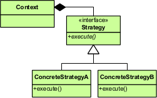

Strategy pattern

<!-- more -->

# 引言

## 编写鸭子项目

- 有各种鸭子(比如 野鸭、北京鸭、水鸭等， 鸭子有各种行为，比如 叫、飞行等)
-  显示鸭子的信息

## 使用传统的继承方法

### 定义父类

```java
public abstract class Duck {

	public Duck() {
	
	}

	public abstract void display();//显示鸭子信息
	
	public void quack() {
		System.out.println("鸭子嘎嘎叫~~");
	}
	
	public void swim() {
		System.out.println("鸭子会游泳~~");
	}
	
	public void fly() {
		System.out.println("鸭子会飞翔~~~");
	}
	
}
```

### 定义子类

#### PekingDuck

```java
public class PekingDuck extends Duck {

	@Override
	public void display() {b
		System.out.println("~~北京鸭~~~");
	}
	
	//因为北京鸭不能飞翔，因此需要重写fly
	@Override
	public void fly() {
		System.out.println("北京鸭不能飞翔");
	}

}
```

#### ToyDuck

```java
public class ToyDuck extends Duck{

	@Override
	public void display() {
		System.out.println("玩具鸭");
	}

	//需要重写父类的所有方法
	
	public void quack() {
		System.out.println("玩具鸭不能叫~~");
	}
	
	public void swim() {
		System.out.println("玩具鸭不会游泳~~");
	}
	
	public void fly() {
		System.out.println("玩具鸭不会飞翔~~~");
	}
}
```

#### WildDuck

```java
public class WildDuck extends Duck {

	@Override
	public void display() {
		System.out.println(" 这是野鸭 ");
	}

}
```

## 传统的方式实现的问题分析

- 其它鸭子，都继承了`Duck`类，所以`fly`让所有子类都会飞了，这是不正确的
- 上面说的问题，其实是继承带来的问题：对类的局部改动，尤其超类的局部改
  动，会影响其他部分。会有溢出效应
- 为了改进问题，我们可以通过重写`fly` 方法来解决 => 重写解决
- 问题又来了，如果我们有一个玩具鸭子`ToyDuck`, 这样就需要`ToyDuck`去覆盖`Duck`
  的所有实现的方法，造成效率低下

# 策略模式

## 定义

*Define a family of algorithms,encapsulate each one,and make them interchangeable*

定义一组算法，将每个算法都封装起来，并且使它们之间可以互换



