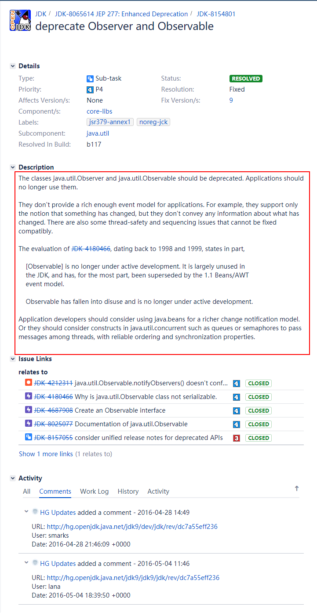
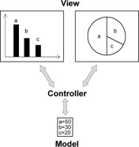

《Head First Design Patterns》--The Observer Pattern

<!-- more -->

# 引言

## 报纸订阅

可以从报纸或杂志的订阅方式去了解观察者模式是什么

报纸或杂志的订阅方式：


从上面的订阅方式可以这样认为观察者模式：

**Publishers + Subscribers = Observer Pattern**
报纸出版商 + 订阅者 = 观察者模式

we call the publisher the **SUBJECT** and the subscribers the **OBSERVERS**.
报纸出版商称为SUBJECT(目标)，订阅者称为OBSERVERS(观察者)


## 继续解释

## 开始时


## 状态改变时


---


---


---


---


------


# 观察者模式

通过上面例子已经生动形象得展示了什么是观察者模式

## 定义

**The Observer Pattern** defines a one-to-many dependency between objects so that when one object changes state, all of its dependents are notified and updated automatically.

**观察者模式**定义了对象之间的一对多依赖，这样一来，当一个对象改变状态时，它的所有依赖者都会收到通知并自动更新。

## 结合定义与之前的例子


`Subject`和`Observer`定义了一对多的关系。`Observer`依赖于此`Subject`，只要`Subject`状态一有变化，`Observer`就会被通知。根据通知的风格，`Observer`可能因为值的更新而更新。
实现观察者模式的方法不只一种，但是以包含`Subject`与`Observer`接口的类设计的做法最常见。

## 类图


观察者模式提供了一种对象设计，让`Subject`和`Observer`之间松耦合。

当两个对象之间松耦合，它们依然可以交互，但是不太清楚彼此的细节。

------

**为什么可以松耦合？**

1. **关于`Observer`的一切，`Subject`只知道`Observer`实现了某个接口（也就是`Observer`接口）**。`Subject`不需要知道`Observer`的具体类是谁、做了些什么或其他任何细节。

2. **任何时候我们都可以增加新的`Observer`**。因为`Subject`唯一依赖的东西是一个实现`Observer`接口的对象列表，所以我们可以随时增加`Observer`。事实上，在运行时我们可以用新的`Observer`取代现有的`Observer`，`Subject`不会受到任何影响。同样的，也可以在任何时候删除某些`Observer`。

3. **有新类型的`Observer`出现时，`Subject`的代码不需要修改**。假如我们有个新的具体类需要当`Observer`，我们不需要为了兼容新类型而修改`Subject`的代码，所有要做的就是在新的类里实现此`Observer`接口，然后注册为`Observer`即可。`Subject`不在乎别的，它只会发送通知给所有实现了`Observer`接口的对象。

4. **我们可以独立地复用`Subject`或`Observer`**。如果我们在其他地方需要使用`Subject`或`Observer`，可以轻易地复用，因为二者并非紧耦合。
5. 改变`Subject`或`Observer`其中一方，并不会影响另一方。因为两者是松耦合的，所以只要他们之间的接口仍被遵守，我们就可以自由地改变他们。

# 气象监测应用

## 情况介绍


------


------


------


## 实现


------


### Subject接口

```java
/**
 * @author GreenHatHG
 **/
public interface Subject {

    /**
     * 这两个方法都需要一个Observer作为变量，该Observer是用来注册或被删除的。
     * @param o
     */
    public void regeisterObserver(Observer o);
    public void removeObserver(Observer o);

    /**
     * 当Subject状态改变时，这个方法会被调用，用以通知所有的Observer
     */
    public void notifyObservers();

}
```

### Observer接口

```java
/**
 * 所有的Observer都必须实现update()方法，以实现Observer接口。
 * @author GreenHatHG
 **/
public interface Observer {

    /**
     * 当气象观测值改变时，Subject会把这些状态作为方法参数传递给Observer
     * @param temp 温度
     * @param humidity 湿度
     * @param pressure 气压
     */
    public void update(float temp, float humidity, float pressure);
}
```

### DisplayElement接口

```java
/**
 * @author GreenHatHG
 **/
public interface DisplayElement {

    /**
     * 当布告板需要显示时，调用此方法
     */
    public void display();
}
```

### WeatherData

```java
import java.util.ArrayList;

/**
 * @author GreenHatHG
 **/
public class WeatherData implements Subject {

    private ArrayList<Observer> observers;
    private float temperature;
    private float humidity;
    private float pressure;

    public WeatherData() {
        observers = new ArrayList<Observer>();
    }

    /**
     * 注册Observer
     * @param o
     */
    public void registerObserver(Observer o) {
        observers.add(o);
    }

    /**
     * 移除Observer
     * @param o
     */
    public void removeObserver(Observer o) {
        int i = observers.indexOf(o);
        if (i >= 0) {
            observers.remove(i);
        }
    }

    /**
     * 我们把状态告诉每一个Observer，因为Observer都实现了apdate（），所以我们知道如何通知它们。
     */
    public void notifyObservers() {
        for (Observer observer : observers) {
            observer.update(temperature, humidity, pressure);
        }
    }

    /**
     * 当气象站得到更新观测值时，我们通知Observer
     */
    public void measurementsChanged() {
        notifyObservers();
    }

    /**
     * 可以从别的地方设置观测值，不一定从气象站
     * @param temperature
     * @param humidity
     * @param pressure
     */
    public void setMeasurements(float temperature, float humidity, float pressure) {
        this.temperature = temperature;
        this.humidity = humidity;
        this.pressure = pressure;
        measurementsChanged();
    }

    public float getTemperature() {
        return temperature;
    }

    public float getHumidity() {
        return humidity;
    }

    public float getPressure() {
        return pressure;
    }

}
```

### 布告板

#### CurrentConditionsDisplay

```java
/**
 * 实现了Observer接口，所以可以从WeatherData对象获得值
 * 也实现了DisplayElement接口，因为规定所有的布告板都必须实现此接口
 * @author GreenHatHG
 **/

public class CurrentConditionsDisplay implements Observer, DisplayElement {
    private float temperature;
    private float humidity;
    /**
     * 为什么要保存WeacherData的引用？
     * 以后我们可能想要取消注册，如果已经有了对Subject的引用会比较方使。
     */
    private Subject weatherData;

    /**
     * 注册
     * @param weatherData
     */
    public CurrentConditionsDisplay(Subject weatherData) {
        this.weatherData = weatherData;
        weatherData.registerObserver(this);
    }

    /**
     * 当update被调用时， 把温度和湿度保存起来，调用display()显示
     * @param temperature
     * @param humidity 湿度
     * @param pressure 气压
     */
    public void update(float temperature, float humidity, float pressure) {
        this.temperature = temperature;
        this.humidity = humidity;
        display();
    }

    /**
     * 只是将最近的温度和湿度显示出来
     */
    public void display() {
        System.out.println("Current conditions: " + temperature
                + "F degrees and " + humidity + "% humidity");
    }
}
```

#### StatisticsDisplay

```java
/**
 * @author GreenHatHG
 **/
public class StatisticsDisplay implements Observer, DisplayElement {
    private float maxTemp = 0.0f;
    private float minTemp = 200;
    private float tempSum= 0.0f;
    private int numReadings;
    private WeatherData weatherData;

    public StatisticsDisplay(WeatherData weatherData) {
        this.weatherData = weatherData;
        weatherData.registerObserver(this);
    }

    public void update(float temp, float humidity, float pressure) {
        tempSum += temp;
        numReadings++;

        if (temp > maxTemp) {
            maxTemp = temp;
        }

        if (temp < minTemp) {
            minTemp = temp;
        }

        display();
    }

    public void display() {
        System.out.println("Avg/Max/Min temperature = " + (tempSum / numReadings)
                + "/" + maxTemp + "/" + minTemp);
    }
}
```

### 测试

```java
/**
 * @author GreenHatHG
 **/
public class WeatherStation {

    public static void main(String[] args) {
        WeatherData weatherData = new WeatherData();

        CurrentConditionsDisplay currentDisplay =
                new CurrentConditionsDisplay(weatherData);
        StatisticsDisplay statisticsDisplay = new StatisticsDisplay(weatherData);

        weatherData.setMeasurements(80, 65, 30.4f);
        weatherData.setMeasurements(82, 70, 29.2f);
        weatherData.setMeasurements(78, 90, 29.2f);
    }
}
```

**输出:**

```java
Current conditions: 80.0F degrees and 65.0% humidity
Avg/Max/Min temperature = 80.0/80.0/80.0
Current conditions: 82.0F degrees and 70.0% humidity
Avg/Max/Min temperature = 81.0/82.0/80.0
Current conditions: 78.0F degrees and 90.0% humidity
Avg/Max/Min temperature = 80.0/82.0/78.0
```

## JDK内置实现

### Implementation with Observer

首先需要说明的是`java.util.observer `已经在`jdk9`中被弃用了：

[[JDK-8154801] deprecate Observer and Observable - Java Bug System](https://bugs.openjdk.java.net/browse/JDK-8154801)



### Implementation with PropertyChangeListener

[Observer is deprecated in Java 9. What should we use instead of it? - Stack Overflow](https://stackoverflow.com/questions/46380073/observer-is-deprecated-in-java-9-what-should-we-use-instead-of-it)

`stackoverflow`相关讨论指出：我们可以使用 **PropertyChangeEvent** and **PropertyChangeListener**实现

#### WeacherData

```java
package jdk9;

import java.beans.PropertyChangeListener;
import java.beans.PropertyChangeSupport;

/**
 * @author GreenHatHG
 **/
public class WeatherData {

    private float temperature;
    private float humidity;
    private float pressure;

    /**
     * 必须有PropertyChangeSupport实例的引用
     * 当类属性发生变化时，有助于发送通知给Observers
     */
    private PropertyChangeSupport support;

    public WeatherData() {
        support = new PropertyChangeSupport(this);
    }

    /**
     * 添加Observer
     * @param pcl
     */
    public void addPropertyChangeListener(PropertyChangeListener pcl) {
        support.addPropertyChangeListener(pcl);
    }

    public void removePropertyChangeListener(PropertyChangeListener pcl) {
        support.removePropertyChangeListener(pcl);
    }

    /**
     * 设置数据
     * @param temperature
     * @param humidity
     * @param pressure
     */
    public void setMeasurements(float temperature, float humidity, float pressure) {
        //当状态改变时，通知Observers
        //参数:属性名称,新值,旧值
        support.firePropertyChange("temperature", this.temperature, temperature);
        support.firePropertyChange("humidity", this.humidity, humidity);
        support.firePropertyChange("pressure", this.pressure, pressure);
        
        //这里设置的顺序和Observer获得顺序保持一样
        this.temperature = temperature;
        this.humidity = humidity;
        this.pressure = pressure;
    }

    public float getTemperature() {
        return temperature;
    }

    public float getHumidity() {
        return humidity;
    }

    public float getPressure() {
        return pressure;
    }

}
```

#### CurrentConditionsDisplay

```java
package jdk9;

import java.beans.PropertyChangeEvent;
import java.beans.PropertyChangeListener;

/**
 * @author GreenHatHG
 **/
public class CurrentConditionsDisplay implements PropertyChangeListener {
    private float temperature;
    private float humidity;
    private float pressure;

    @Override
    public void propertyChange(PropertyChangeEvent evt) {
        //获取值的顺序和WeatherData设置的顺序一样
        this.temperature = (float) evt.getNewValue();
        this.humidity = (float) evt.getNewValue();
        this.pressure = (float) evt.getNewValue();
        display();
    }

    public void display() {
        System.out.println("Current conditions: " + temperature
                + "F degrees and " + humidity + "% humidity");
    }
}
```

#### WeatherStation

```java
package jdk9;

/**
 * @author GreenHatHG
 **/
public class WeatherStation {

    public static void main(String[] args) {
        WeatherData weatherData = new WeatherData();

        CurrentConditionsDisplay currentDisplay =
                new CurrentConditionsDisplay();

        weatherData.addPropertyChangeListener(currentDisplay);

        weatherData.setMeasurements(78, 90, 29.2f);
    }
}
```

# 观察者模式与MVC

**模型**(Model)，**视图**(View)和**控制器**(Controller)

**模型**可对应于观察者模式中的`Subject`，而**视图**对应于`Observer`，**控制器**可充当两者之间的中介者

当**模型层**的数据发生改变时，**视图层**将自动改变其显示内容



# 总结

## 优点

1. 可以实现**表示层和数据逻辑层的分离**

2. 在观察目标和观察者之间**建立一个抽象的耦合**

3. 支持**广播通信，简化了一对多系统设计的难度**

4. **符合开闭原则**，增加新的具体观察者无须修改原有系统代码，在具体观察者与观察目标之间不存在关联关系的情况下，增加新的观察目标也很方便

## 缺点

1. 将所有的观察者都通知到会**花费很多时间**

2. 如果存在**循环依赖**时**可能导致系统崩溃**

3. **没有相应的机制让观察者知道所观察的目标对象是怎么发生变化的**，而只是知道观察目标发生了变化

## 适用环境

1. 一个抽象模型有两个方面，其中**一个方面依赖于另一个方面**，将这两个方面封装在独立的对象中使它们**可以各自独立地改变和复用**

2. **一个对象的改变将导致一个或多个其他对象发生改变，且并不知道具体有多少对象将发生改变，也不知道这些对象是谁**

3. 需要在系统中**创建一个触发链**

