《Head First Design Patterns》--The Observer Pattern

<!-- more -->

# 引言

## 报纸订阅

可以从报纸或杂志的订阅方式去了解观察者模式是什么

报纸或杂志的订阅方式：

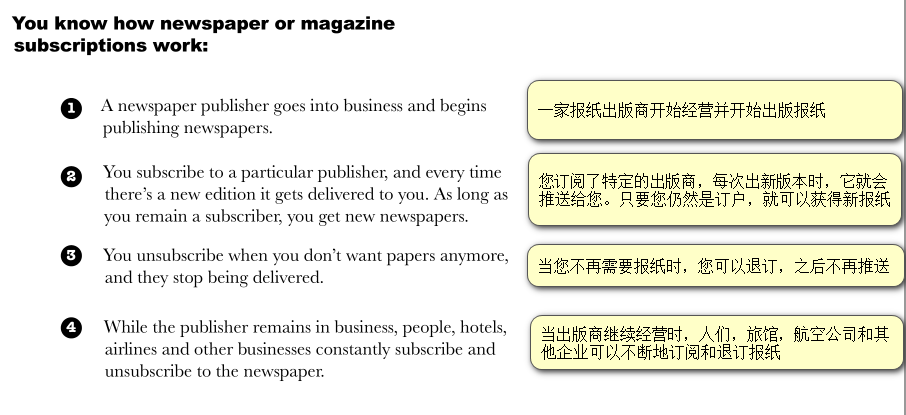

从上面的订阅方式可以这样认为观察者模式：

**Publishers + Subscribers = Observer Pattern**
报纸出版商 + 订阅者 = 观察者模式

we call the publisher the **SUBJECT** and the subscribers the **OBSERVERS**.
报纸出版商称为SUBJECT(目标)，订阅者称为OBSERVERS(观察者)


## 继续解释

## 开始时

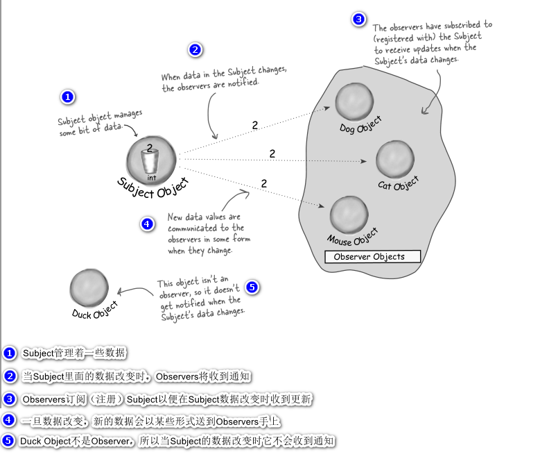

## 状态改变时

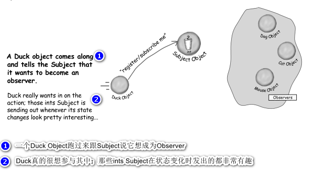

---

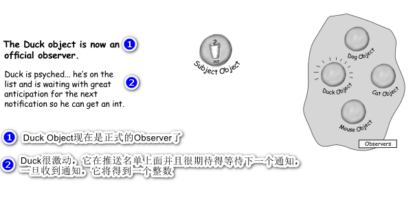

---

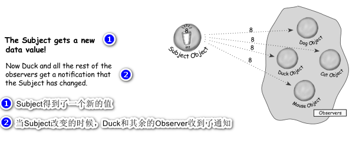

---

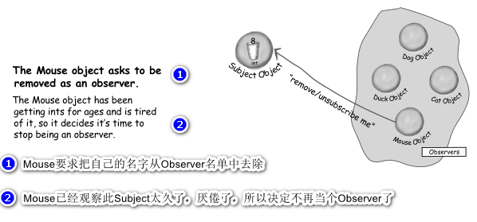

---

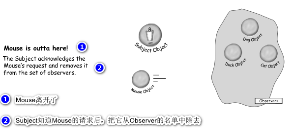

------

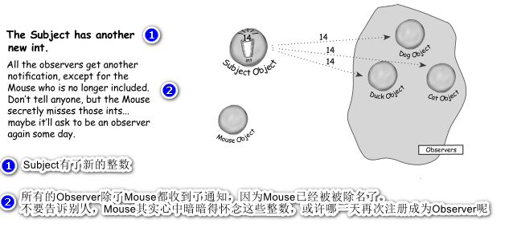

# 观察者模式

通过上面例子已经生动形象得展示了什么是观察者模式

## 定义

**The Observer Pattern** defines a one-to-many dependency between objects so that when one object changes state, all of its dependents are notified and updated automatically.

**观察者模式**定义了对象之间的一对多依赖，这样一来，当一个对象改变状态时，它的所有依赖者都会收到通知并自动更新。

## 结合定义与之前的例子

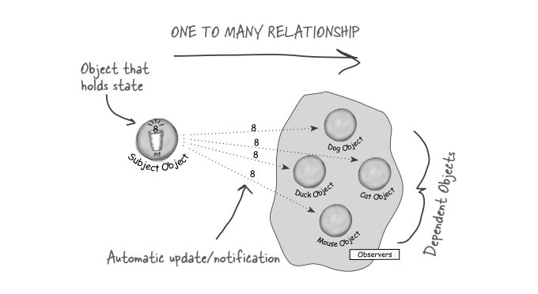

`Subject`和`Observer`定义了一对多的关系。`Observer`依赖于此`Subject`，只要`Subject`状态一有变化，`Observer`就会被通知。根据通知的风格，`Observer`可能因为值的更新而更新。
实现观察者模式的方法不只一种，但是以包含`Subject`与`Observer`接口的类设计的做法最常见。

## 类图

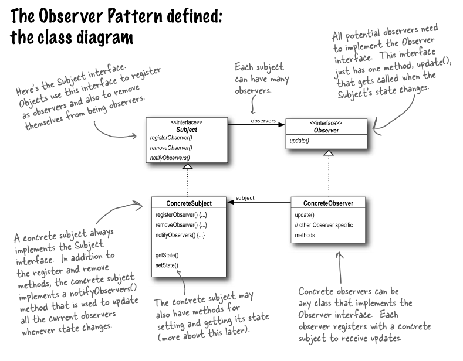

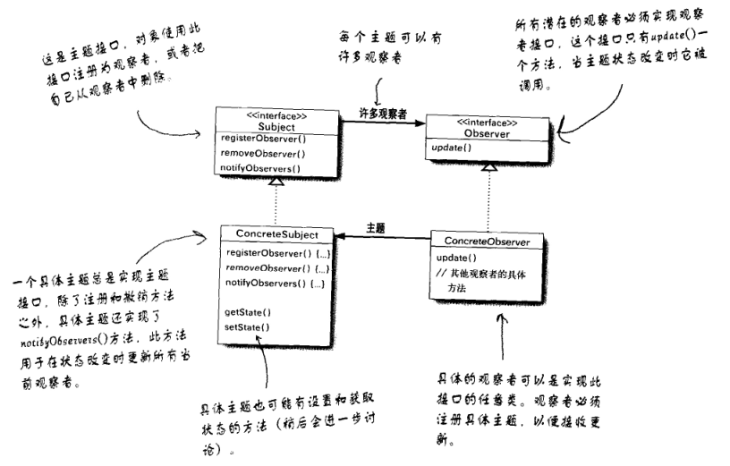

观察者模式提供了一种对象设计，让`Subject`和`Observer`之间松耦合。

当两个对象之间松耦合，它们依然可以交互，但是不太清楚彼此的细节。

------

**为什么可以松耦合？**

1. **关于`Observer`的一切，`Subject`只知道`Observer`实现了某个接口（也就是`Observer`接口）**。`Subject`不需要知道`Observer`的具体类是谁、做了些什么或其他任何细节。

2. **任何时候我们都可以增加新的`Observer`**。因为`Subject`唯一依赖的东西是一个实现`Observer`接口的对象列表，所以我们可以随时增加`Observer`。事实上，在运行时我们可以用新的`Observer`取代现有的`Observer`，`Subject`不会受到任何影响。同样的，也可以在任何时候删除某些`Observer`。

3. **有新类型的`Observer`出现时，`Subject`的代码不需要修改**。假如我们有个新的具体类需要当`Observer`，我们不需要为了兼容新类型而修改`Subject`的代码，所有要做的就是在新的类里实现此`Observer`接口，然后注册为`Observer`即可。`Subject`不在乎别的，它只会发送通知给所有实现了`Observer`接口的对象。

4. **我们可以独立地复用`Subject`或`Observer`**。如果我们在其他地方需要使用`Subject`或`Observer`，可以轻易地复用，因为二者并非紧耦合。
5. 改变`Subject`或`Observer`其中一方，并不会影响另一方。因为两者是松耦合的，所以只要他们之间的接口仍被遵守，我们就可以自由地改变他们。

# 气象监测应用

## 情况介绍

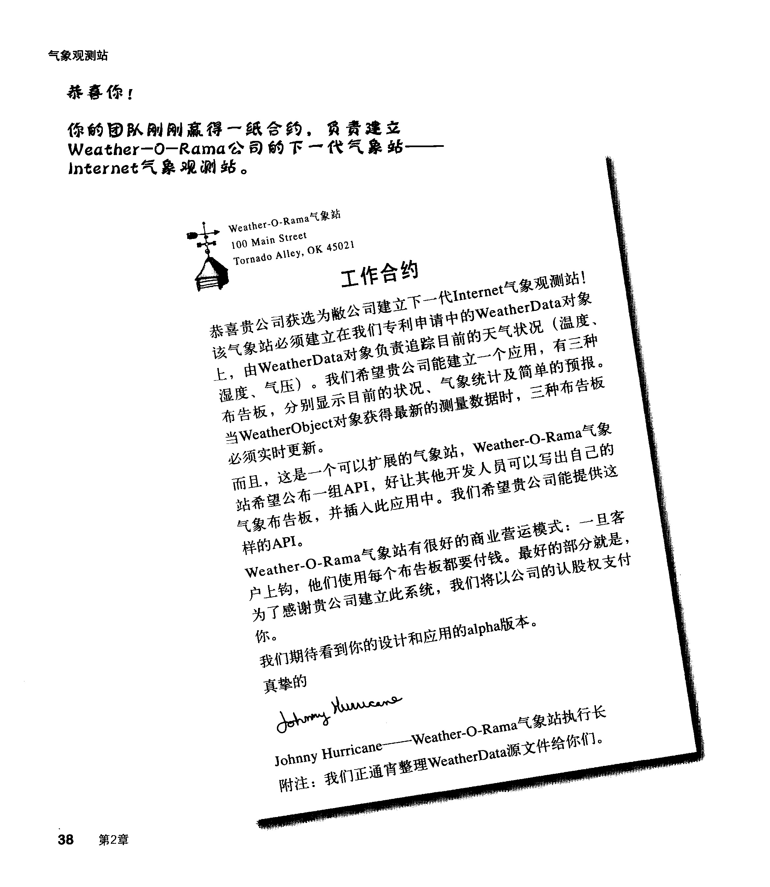

------

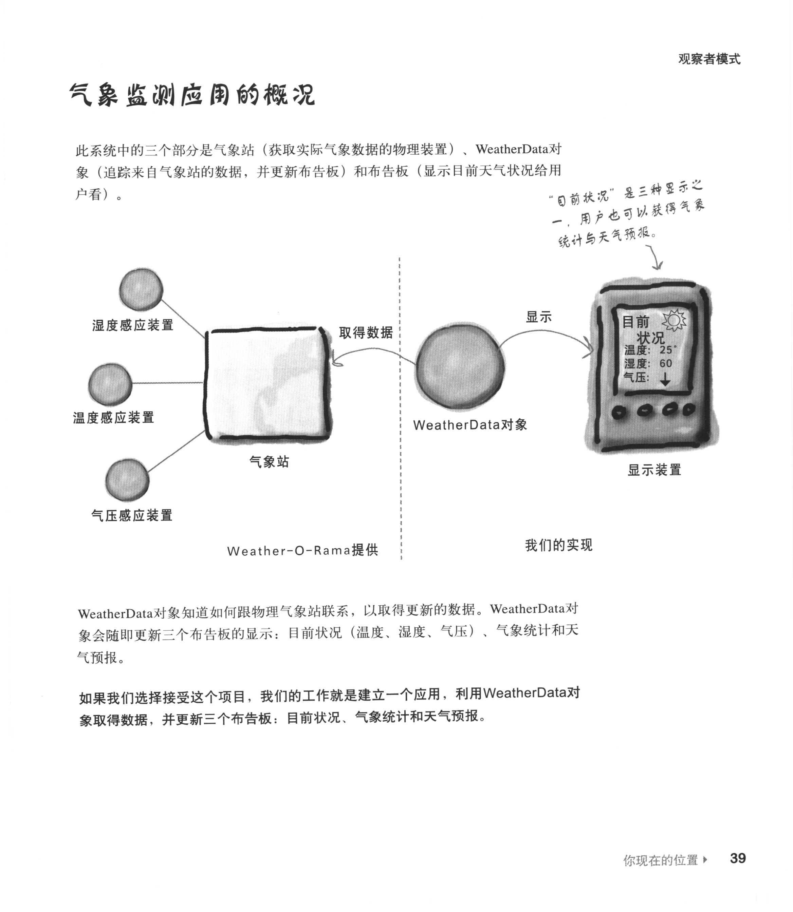

------

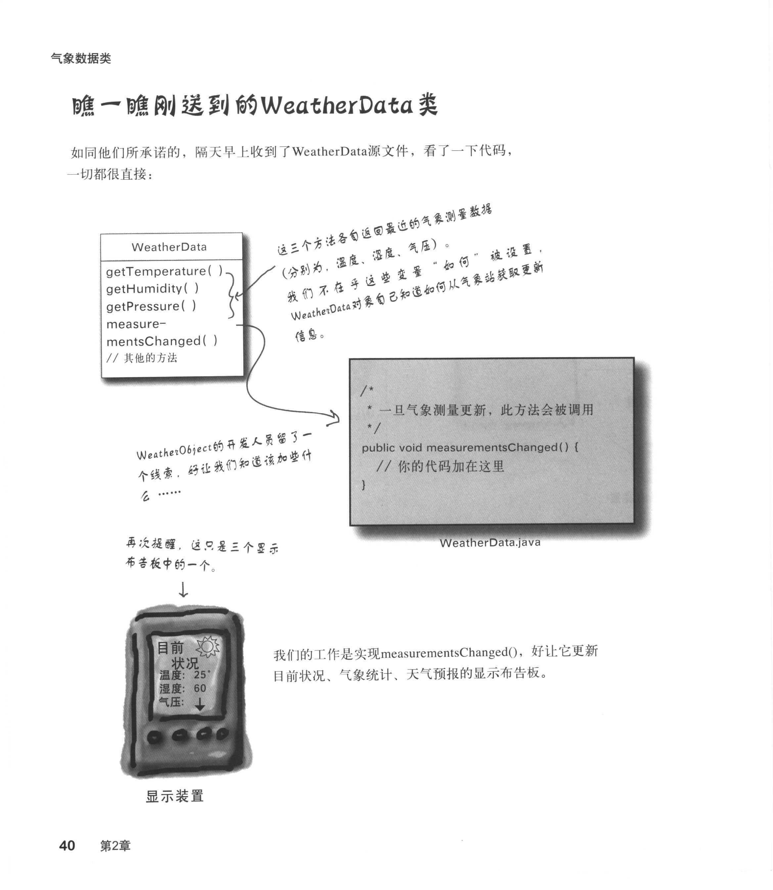

------

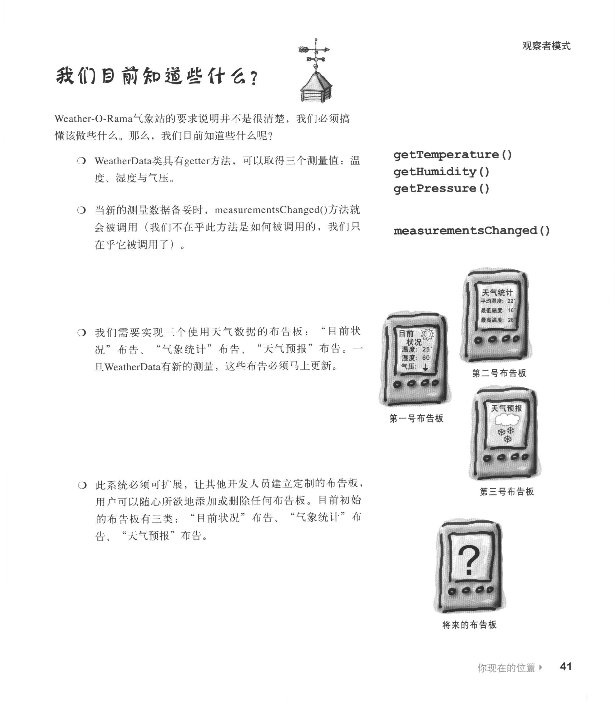

## 实现

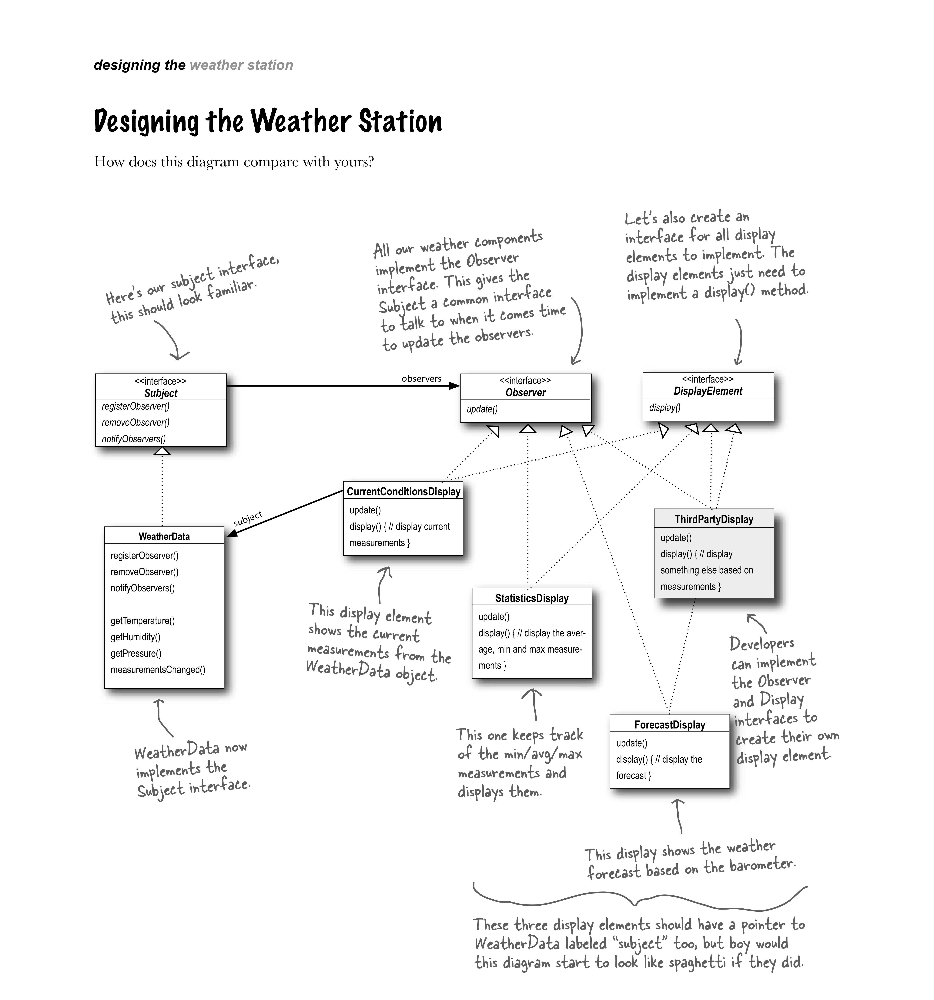

------

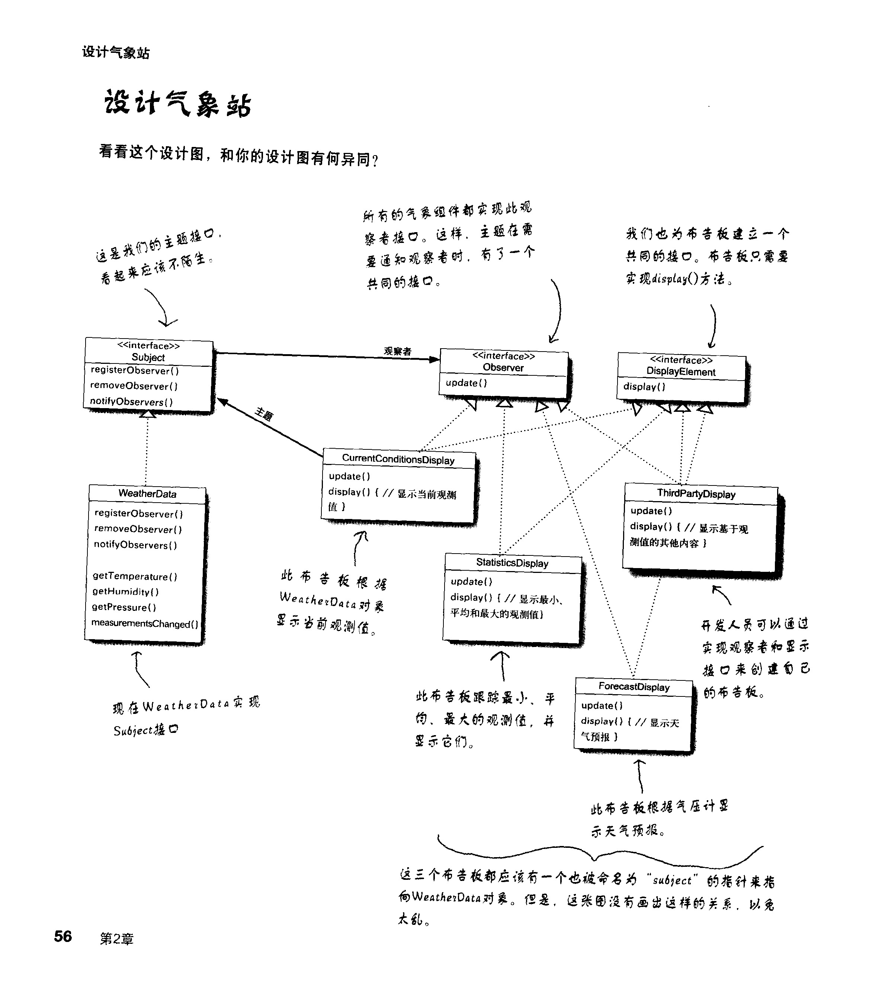

### Subject接口

```java
/**
 * @author GreenHatHG
 **/
public interface Subject {

    /**
     * 这两个方法都需要一个Observer作为变量，该Observer是用来注册或被删除的。
     * @param o
     */
    public void regeisterObserver(Observer o);
    public void removeObserver(Observer o);

    /**
     * 当Subject状态改变时，这个方法会被调用，用以通知所有的Observer
     */
    public void notifyObservers();

}
```

### Observer接口

```java
/**
 * 所有的Observer都必须实现update()方法，以实现Observer接口。
 * @author GreenHatHG
 **/
public interface Observer {

    /**
     * 当气象观测值改变时，Subject会把这些状态作为方法参数传递给Observer
     * @param temp 温度
     * @param humidity 湿度
     * @param pressure 气压
     */
    public void update(float temp, float humidity, float pressure);
}
```

### DisplayElement接口

```java
/**
 * @author GreenHatHG
 **/
public interface DisplayElement {

    /**
     * 当布告板需要显示时，调用此方法
     */
    public void display();
}
```

### WeatherData

```java
import java.util.ArrayList;

/**
 * @author GreenHatHG
 **/
public class WeatherData implements Subject {
    private ArrayList<Observer> observers;
    private float temperature;
    private float humidity;
    private float pressure;

    public WeatherData() {
        observers = new ArrayList<Observer>();
    }

    public void registerObserver(Observer o) {
        observers.add(o);
    }

    public void removeObserver(Observer o) {
        int i = observers.indexOf(o);
        if (i >= 0) {
            observers.remove(i);
        }
    }

    public void notifyObservers() {
        for (Observer observer : observers) {
            observer.update(temperature, humidity, pressure);
        }
    }

    public void measurementsChanged() {
        notifyObservers();
    }

    public void setMeasurements(float temperature, float humidity, float pressure) {
        this.temperature = temperature;
        this.humidity = humidity;
        this.pressure = pressure;
        measurementsChanged();
    }

    public float getTemperature() {
        return temperature;
    }

    public float getHumidity() {
        return humidity;
    }

    public float getPressure() {
        return pressure;
    }

}
```

