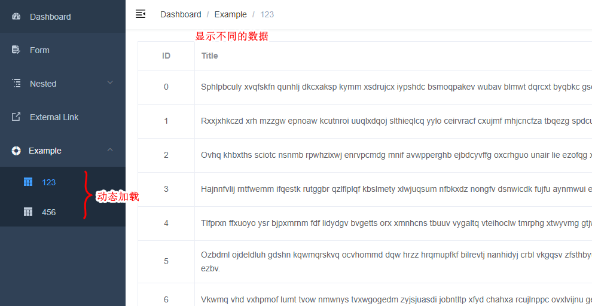
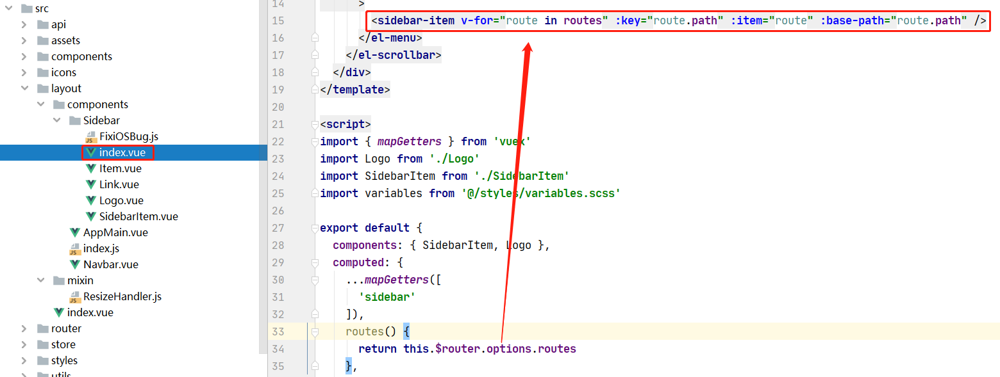
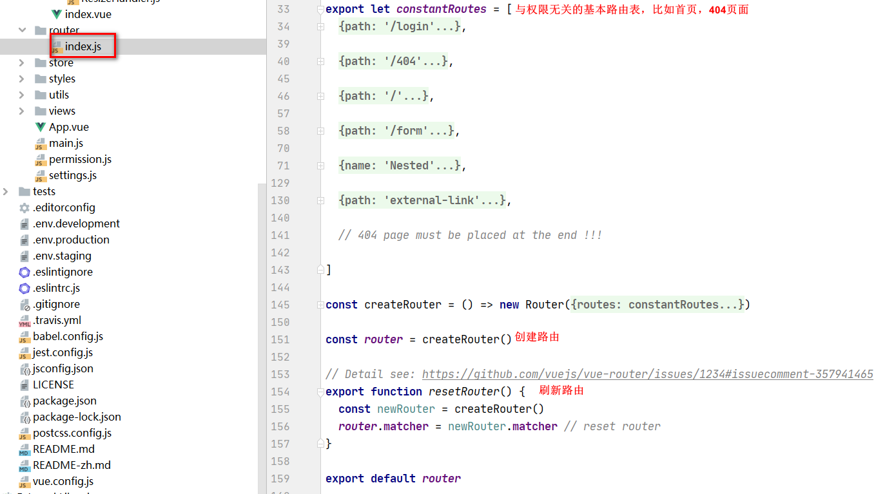
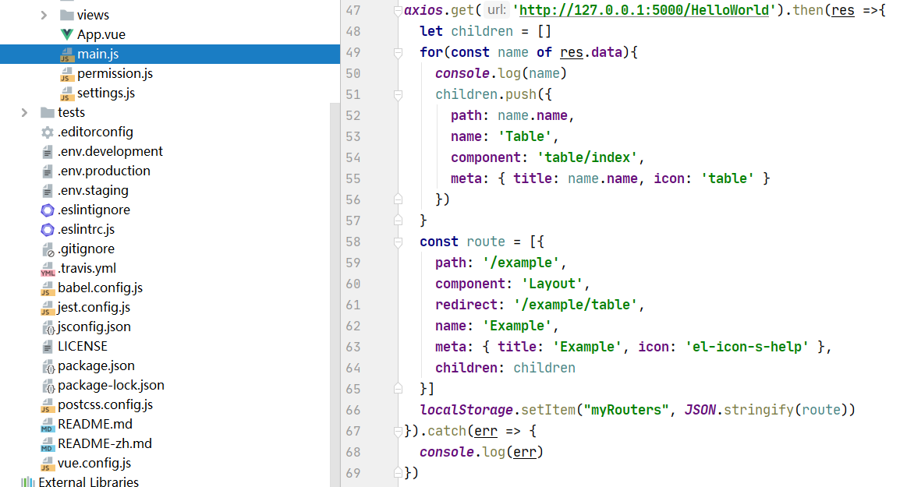
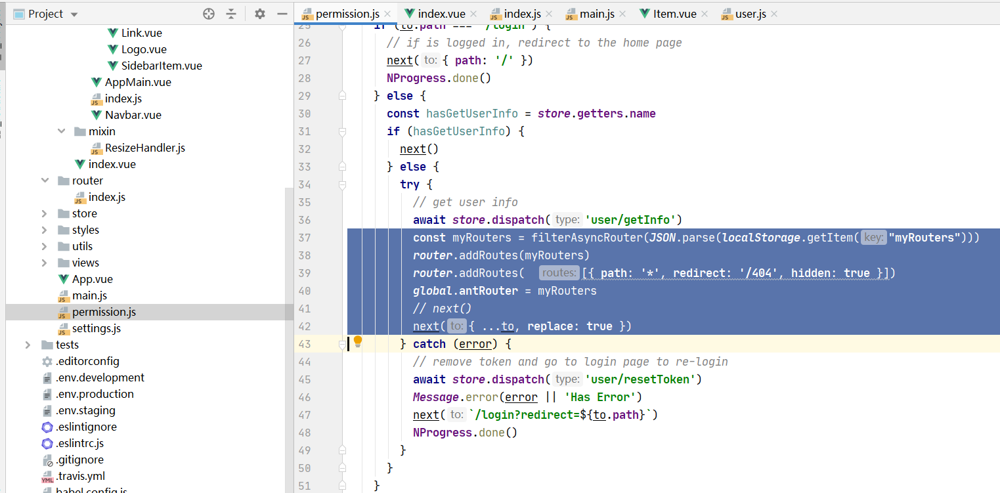
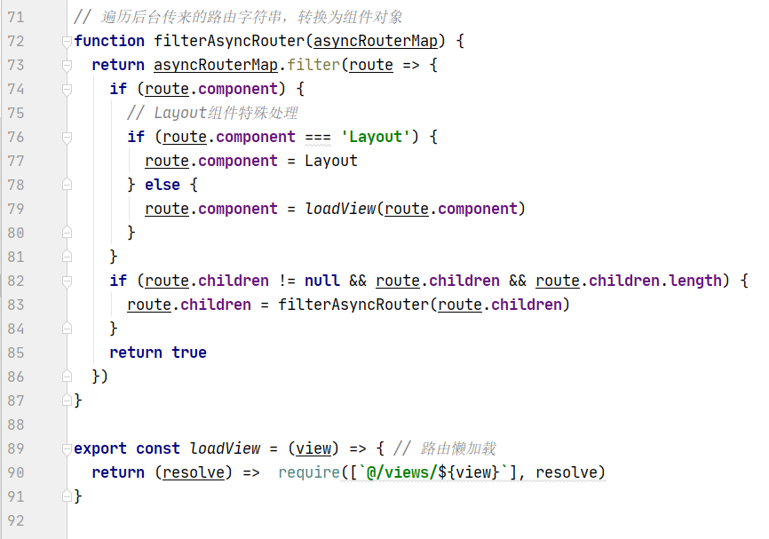
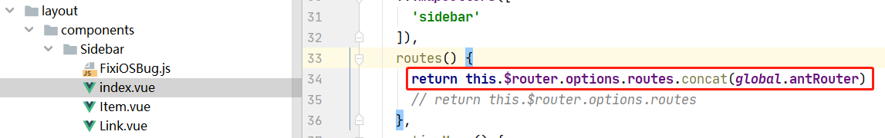

vue-admin-template动态路由填坑

<!-- more -->

# 需求背景

不涉及权限简单要求动态侧边栏动态加载菜单（路由信息请求后台），然后根据不同的路由显示不同的表格数据

# vue-admin-template刷新逻辑

在`src\layout\components\Sidebar\index.vue`文件中，每个item是根据路由的元信息（一个数组）去渲染的

在`src\router\index.js`配置了项目的基本路由表，因为这个模板是简单模板，所以并没有带权限路由表

项目启动后，这里会创建路由表，然后由上面`sidebar`渲染，注意这里是异步创建路由表

根据上面所知，如果我们想要修改显示的侧边栏，是不是直接修改`constantRoutes`变量就行了？

这个是可以的，在渲染前将想要加载的侧边栏添加到变量里面，然后渲染时就可以加载了，但是有个问题

虽然可以显示了，但是点击动态显示的侧边栏后再刷新会显示404

# vue-router刷新后404

点击显示出来的sub-menu可以跳转进对应的表格，但是在当前表格页面刷新就会跳转到404，**因为刷新页面`vuex`和`router`实例会重新初始化到初始状态，所以新增的动态路由会被刷掉（页面刷新的时候vuex中的数据和router实例对象会被重新初始化）**

所以我们可以设置全局路由前置守卫`beforeEach(to, from. next)`，用户刷新页面时，包括在动态路由页面刷新页面，此时触发`beforeEach()`，再使用`this.$router.addRoutes(this.userDynamicRouters)`向router对象中添加动态路由，之后执行前置守卫的`next()`方法跳转路由

[导航守卫 | Vue Router]([https://router.vuejs.org/zh/guide/advanced/navigation-guards.html#%E5%85%A8%E5%B1%80%E5%89%8D%E7%BD%AE%E5%AE%88%E5%8D%AB](https://router.vuejs.org/zh/guide/advanced/navigation-guards.html#全局前置守卫))

# 简化版实现

## 获取路由数据

因为需求是加载一次动态路由就行了，所以我们可以提前获取路由信息，然后保存到`localStorage`

注意`localStorage`只能存储字符串，所以这里需要序列化一下再保存

## 动态路由添加

因为`vue-admin-template`在`permission.js`已经有路由守卫了，所以直接在原基础上面改就行

这里需要注意的是39行，404页面的路由需要在最后面加，否则可以会导致提前匹配到404页面，同理之前`src\router\index.js`的`constantRoutes`路由表需要去掉该信息

同时需要注意应该将41行改为42行那样：

直接 `next()`会发现 `addRoutes` 可能还没有把所有路由都成功挂载，将会看到一个空白页，什么都没有；但是在next中添加一个地址，会中断当前的导航，并创建一个新的导航，新的导航在开始时会确认routes，从而保证了addroutes完成并生效

## 将字符串转为对应的组件

这里需要注意的是转换非'Layout'组件的方法，79那里不能直接`route.component = ()=> import(route.component)`

是因为当异步执行的时候，`router.component`已经成了一个函数，不是一个字符串了

还有一个注意的地方，90行这里`@/views/${view}`一定得是这种格式，否则会报404，这个原因未明

## 拼接渲染路由

最后渲染时，基础路由和动态路由合并

## 请求不同的数据

可以由`this.$route.name`去获取对应的route名字，从而发不同请求获取不同的数据渲染

---

参考：

[vue-element-admin登录逻辑，以及动态添加路由，显示侧边栏 - 古墩古墩 - 博客园](https://www.cnblogs.com/fqh123/p/11094296.html)

[Vue-router-3.0.1 使用router.addRoutes()设置动态路由，页面刷新后无效 - 中文 - Vue Forum](https://forum.vuejs.org/t/vue-router-3-0-1-router-addroutes/33181/6)

[大神 我这个地方这么写怎么会死循环呢 · Issue #817 · PanJiaChen/vue-element-admin](https://github.com/PanJiaChen/vue-element-admin/issues/817)

[vue-element-admin 实现动态路由(从后台查询出菜单列表绑定侧边栏) - 胡椒面 - 博客园](https://www.cnblogs.com/langhaoabcd/p/11346227.html)