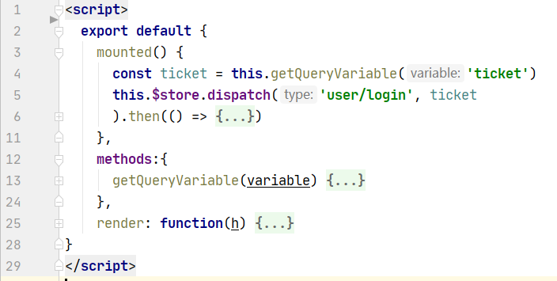

vue-admin-template接入公司内部认证系统总结

<!-- more -->

# 主要逻辑

1. 检测用户有没有登录
2. 没有则跳转至`http://xxx.com?url=<return_url>`
3. 授权后跳回`return_url`从url中获取token
4. 解析token，保存用户数据
5. 登录后的逻辑

# 跳转部分

## 修改login页面

里面我们只需要在框架中添加跳转页面以及跳转后处理页面即可，其他的框架已经使用路由帮我们处理

因为判断到没有登录会重定向到`/login`，所以我们可以修改`/login`对应的页面，让其直接跳转到认证页面

```javascript
// src/views/login/index.vue
<script>
  export default {
    created() {
      window.location.href = 'http://passport.oa.com/modules/passport/signin.ashx?url=http://127.0.0.1:9527/#/ioa'
    }
  }
</script>
```

## 添加跳转后处理页面

这里跳转后的页面是`/oauth`，所以我们需要添加一个全新页面去获取`token`

### 添加路由

```javascript
{
    path: '/oauth',
    component: () => import('@/views/login/oauth'),
    hidden: true
  }
```

### 添加处理页面

跳转后的url大概长这个样子

```
http://xx.com/?token=xx#/oauth
```

我们需要提取出token的内容，使用下面方法即可提取

```javascript
getQueryVariable(variable) {
  const query = window.location.search.substring(1);
  const vars = query.split("&");
  for (let i = 0; i < vars.length; i++) {
    const pair = vars[i].split("=");
    if (pair[0] === variable) {
      return pair[1]
    }
  }
  return false
}
const token = this.getQueryVariable('token')
```

# 处理部分

## 解析token

发送get请求到特定的url即可获得到用户信息，这里使用的方式是后端获取，因为前端存在跨域问题，配置了一下不能解决，所以改为后端获取

然后后端解析l完成后把信息发回前端，大概实现如下

```javascript
this.$store.dispatch('user/login', ticket).then(...)
```

这里token是随机给的，因为用不上token，同时框架判断登录等逻辑需要用到token，为了避免大改动，所以添加了个随机token

```javascript
//src/store/modules/user.js
login({ commit }, ticket) {
    return new Promise((resolve, reject) => {
      axios.post('http://127.0.0.1:8090/api/login', {
        "ticket": ticket
      }, {timeout: 1000 * 20}).then(res=>{
        const token = Math.random().toString(36).slice(-8)
        commit('SET_TOKEN', token)
        setToken(token)
        if(res.data.code === 0){
          setLocalStorage('userInfo', res.data.data)
          resolve()
        }else{
           //...
        }
      }).catch(error => {
        reject(error)
      })
    })
  }
```

整个处理页面看起来就是这样`src/views/login/oauth.vue`



**路由处理是最核心也是比较难处理的一点**，处理不好的话可能会导致

1. 浏览器无限加载，白屏
2. 死循环，性能占用大幅上升，可能会造成浏览器卡死

[vue-admin-template动态路由 - GreenHatHGのBlog](https://greenhathg.github.io/2020/07/08/vue-admin-template%E5%8A%A8%E6%80%81%E8%B7%AF%E7%94%B1/)

相比之前的方案进行了一些调整，主要更改点：

1. 将请求动态路由数据部分放到了beforeEach里面处理
2. 添加`ioa`页面处理

```javascript
import router from './router'
import store from './store'
import { Message, MessageBox } from 'element-ui'
import NProgress from 'nprogress' // progress bar
import 'nprogress/nprogress.css' // progress bar style
import { getToken } from '@/utils/auth' // get token from cookie
import getPageTitle from '@/utils/get-page-title'
import Layout from '@/layout/index'
import axios from "axios";
import {getLocalStorage, setLocalStorage} from "@/utils/my-utils";

NProgress.configure({ showSpinner: false }) // NProgress Configuration

const whiteList = ['/login', '/ioa'] // no redirect whitelist

const myRouterKey = 'myRouter'
let getRouter = []; //后台拿到的路由

function addRouter(to, next){
  console.log('addRouter', getRouter)
  const myRouters = filterAsyncRouter(getRouter)
  router.addRoutes(myRouters)
  router.addRoutes(  [{ path: '*', redirect: '/404', hidden: true }])
  global.antRouter = myRouters
  next({ ...to, replace: true })
}

function setRouter(data){
  console.log('data', data)
  getRouter = []
  let children = []
  for (const name of data) {
    children.push({
      path: name,
      name: name,
      component: '@/views/table/sss',
      meta: {title: name, icon: 'table'}
    })
  }
  getRouter.push({
    path: '/ss',
    component: 'Layout',
    redirect: '/ss/table',
    name: 'ApiData',
    meta: {title: 'sss', icon: 'el-icon-s-help'},
    children: children
  })
  setLocalStorage(myRouterKey, getRouter)
}

router.beforeEach(async(to, from, next) => {
  // start progress bar
  NProgress.start()

  // set page title
  document.title = getPageTitle(to.meta.title)

  // determine whether the user has logged in
  const hasToken = getToken()

  if (hasToken) {
    if (to.path === '/login') {
      // if is logged in, redirect to the home page
      next({ path: '/' })
      NProgress.done()
    } else {
      const hasGetUserInfo = store.getters.name
      if (hasGetUserInfo) {
        next()
      } else {
        try {
          // get user info
          await store.dispatch('user/getInfo')
          //不加这个判断，路由会陷入死循环
          if (getRouter.length === 0) {
            if(!getLocalStorage(myRouterKey)){
              console.log('read from axios')
              axios.get('http://xx.com/getProjectList', {timeout: 5000}).then(res => {
                setRouter(res.data)
                addRouter(to, next)
              }).catch(err =>{
                console.error('addRouter', err)
                setRouter(['xxx'])
                addRouter(to, next)
              })
            }else{
              console.log('read from local')
              getRouter = JSON.parse(getLocalStorage(myRouterKey))
              addRouter(to, next)
            }
          }else{
            console.log('next')
            next()
          }
        } catch (error) {
          // remove token and go to login page to re-login
          await store.dispatch('user/resetToken')
          console.error(error.message)
          Message({
            message: error.message,
            type: 'error',
            duration: 5 * 1000
          })
          await MessageBox.confirm('登录失败，请刷新重试', {
            confirmButtonText: '确定',
            type: 'error'
          })
          next(`/login?redirect=${to.path}`)
          NProgress.done()
        }
      }
    }
  } else {
    /* has no token*/

    if (whiteList.indexOf(to.path) !== -1) {
      // in the free login whitelist, go directly
      next()
    } else {
      // other pages that do not have permission to access are redirected to the login page.
      next(`/login`)
      NProgress.done()
    }
  }
})

router.afterEach(() => {
  // finish progress bar
  NProgress.done()
})

// 遍历后台传来的路由字符串，转换为组件对象
function filterAsyncRouter(asyncRouterMap) {
  return asyncRouterMap.filter(route => {
    if (route.component) {
      if (route.component === 'Layout') {
        route.component = Layout
      } else {
        route.component = () => import('@/views/table/APIManage')
      }
    }
    if (route.children && route.children.length) {
      route.children = filterAsyncRouter(route.children)
    }
    return true
  })
}
```

大部分和框架原本一样，注意细节即可

# 处理后

## 跳到首页

```javascript
//src/views/login/oauth.vue
this.$store.dispatch('user/login', ticket).then(() => {
  const originUrl = window.location.origin
  history.replaceState({}, '', originUrl)
  this.$router.push({ path: '/dashboard' })
})
```

这里因为url已经改变了(添加了`token`)等参数，所以需要对url进行处理，然后push首页的路径到路由即可

# 经验总结

1. 改了源码f12大量报错怎么办
   ：建议一开始不要删除源代码，而且不要乱改原本变量名，待功能可行后再删掉不用代码和修改一些全局变量名等
2. 修改路由后浏览器白屏怎么办
   - 这里主要是通过看f12报的异常信息，如果浏览器突然卡顿，不能正常退出，多半是路由死循环，可以看下`src/permission.js`部分
     本次实战：修改`src/store/modules/user.js`中的`login`方法后未同步修改`getInfo`方法，导致`await store.dispatch('user/getInfo')`报错，在`src/permission.js`中try catch捕捉后又重定向到login页面（因为出了异常还没有登录成功）,所以接着循环这个过程，导致路由死循环，浏览器不断刷新卡死
     tips：在catch里面可以把打印error变为打印error.message，同时添加sleep，避免频繁刷新
   - 浏览器不卡顿的话多半是`login`方法和`getInfo`方法没有修改对
   - 刷新后一直白屏：这种可能是值没有保存好，导致刷新后值为空，路由部分异常