简单按照源码实现下「 List to JsonStr」。直接实现也很简单，不过为了锻炼下阅读源码的能力，还是练习跟踪下源码，找出大体框架，不沉迷细节，把握整体。 

<!-- more -->

# Gson的使用

## 环境约定

这里使用的 Java 环境，使用 Maven 管理依赖

- Oracle JDK8

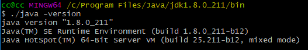

- Gson2.8.6

  ```java
  <dependency>
      <groupId>com.google.code.gson</groupId>
      <artifactId>gson</artifactId>
      <version>2.8.6</version>
  </dependency>
  ```

## 使用

```java
import com.google.gson.Gson;
import java.util.ArrayList;

/**
 * @author GreenHatHG
 * @since 2020-05-12
 */
public class GsonTest {

    static class Student{
        private int id;
        private String name;
        private double grade;

        public Student(int id, String name, double grade) {
            this.id = id;
            this.name = name;
            this.grade = grade;
        }
		
        //getter方法省略
    }

    public static void main(String[] args) {
        Gson gson = new Gson();
        ArrayList<Student> students = new ArrayList<>();
        students.add(new Student(2020, "李四", 78));
        students.add(new Student(3030, "王五", 85));
        students.add(new Student(4040, "张三", 99));
        String s = gson.toJson(students);
        System.out.println(s);
    }
}
```

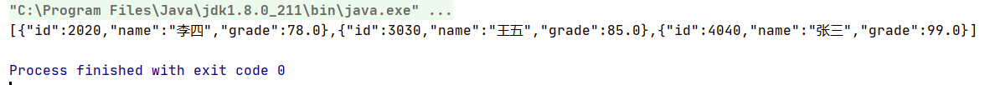

#  跟踪过程

## 找到的第一个抽象write方法

1. 查看 ` gson.toJson(students)`的源码，位于`Gson.java`

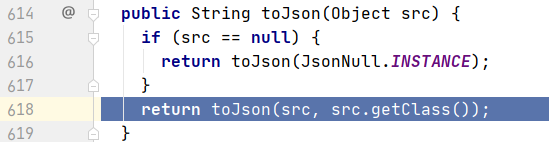

2. 这里面很明显， 615 行代码不会执行，转向 618 行的源码，位于` Gson.java`。

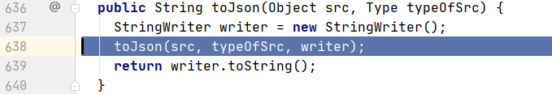

3. 这时候一看就是知道是 638 行代码执行起的序列化作用，该行源代码同样位于`Gson.java`

   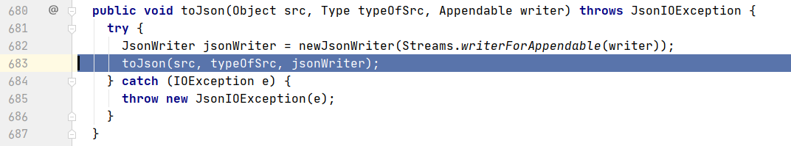

4. 依旧点进去 683 行的源代码，位于`Gson.java`

   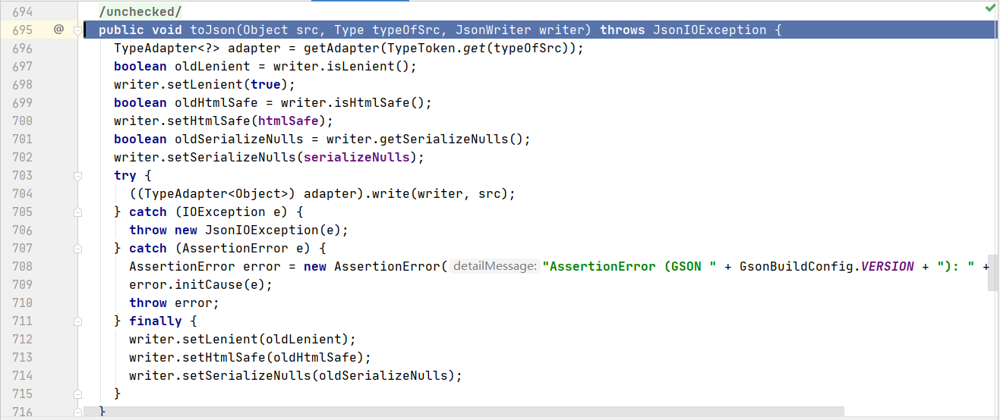

   一看代码有点多，但是主要部分还是容易看出来的

   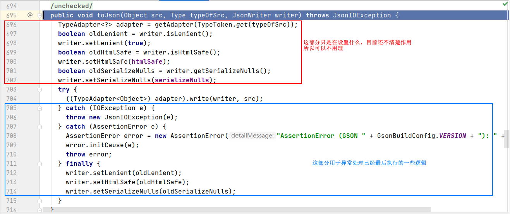

5. 所以可以直接跳到 704 行代码，位于`TypeAdapter.java`

   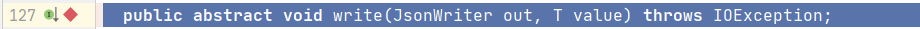

   从类名带 `Adapter` 来看，运用了适配器模式，这方面这里不展开

   这里是抽象方法，我们不知道会调用了哪个实现了它的方法，所以我们可以打上断点去调试，然后开启调试

## 找到的第二个抽象write方法

1. 根据上面开启调试，会立马定位到该方法，位于`CollectionTypeAdapterFactory.java`

   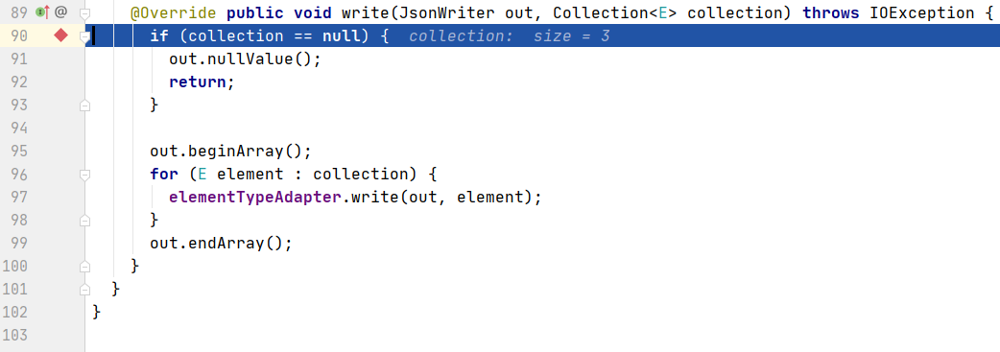

2. 为了搞明白，我们依旧得利用调试去查看每个方法的作用，首先在 95 行断点，按照这里来看，序列化的内容应该会输出在`out`这个变量里面，目前`out`变量里面的内容：

   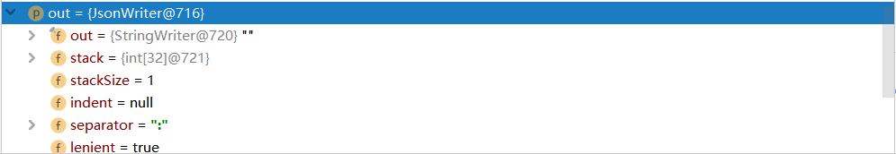

   经过 95 行后，变成

   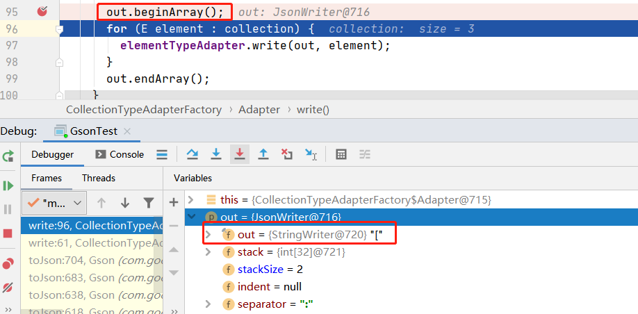

   可见`out.beginArray();`和`out.endArray();`只是在序列化字符串前后加个`[ ]`，我们直接模拟实现即可

3. 那么重点应该是 96 那里了，我们可以看`collection`变量里面的内容

   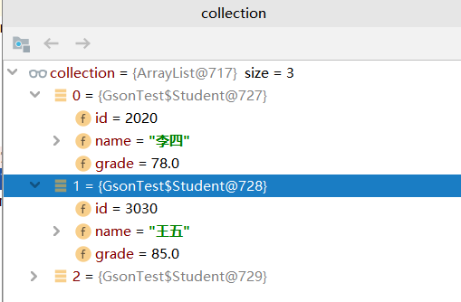

   里面是我们之前创建的三个`Student`对象，那么自然 97 行代码也就是对每个对象进行序列化了

4. 点进去后同样跳到了抽象的`write`方法，位于`TypeAdapter.java`，用同样的加断点方法进行调试

   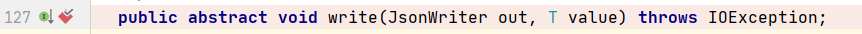

## 找到的第三个抽象write方法

1. 根据上面调试，跳到如下位置，位于`TypeAdapterRuntimeTypeWrapper.java`

   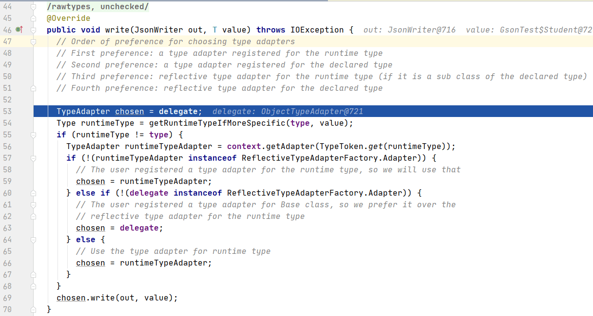
   
   这时候我们可以选择直接断点在 69 行，查看序列化字符串变化情况。现在断点在 53 行的情况：
   
   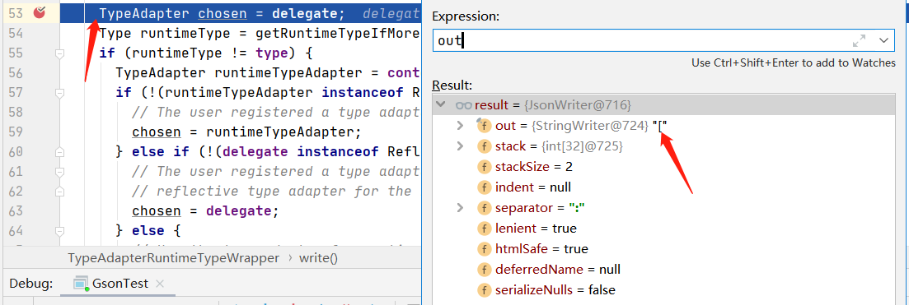
   
   待程序执行到 69 行，`out`变量里面的内容依旧没有变化
   
   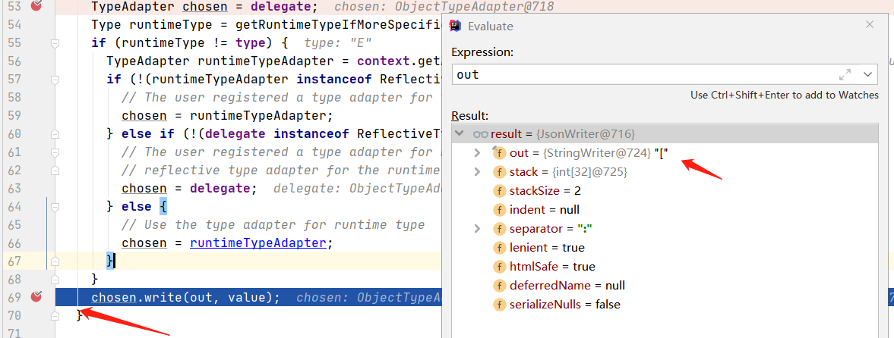
   
   那么可以确定序列化代码在 69 行了。

2. 点进 69 行代码，位于`TypeAdapter.java`，如下：

   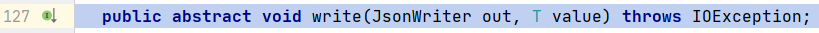

   这时候我们可以看到其实每次调用的这些的抽象`write`方法都是一样的，但是实现类却不一样，每个都有自己的功能。

   ~~这个过程就好像套娃一样，老千层饼了~~

   那么依旧断点在 127 行这个抽象的`write`方法，为了避免其他的断点的干扰，以及方便跳到我们想要的地方，我们可以把其他断点去掉先，选择后按`delete`键可以删除

   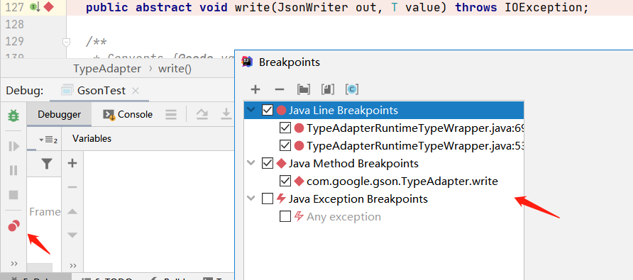

   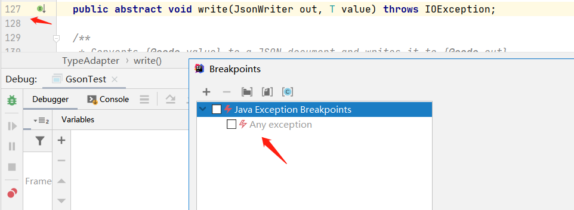

   然后我们再给 127 行打上断点

   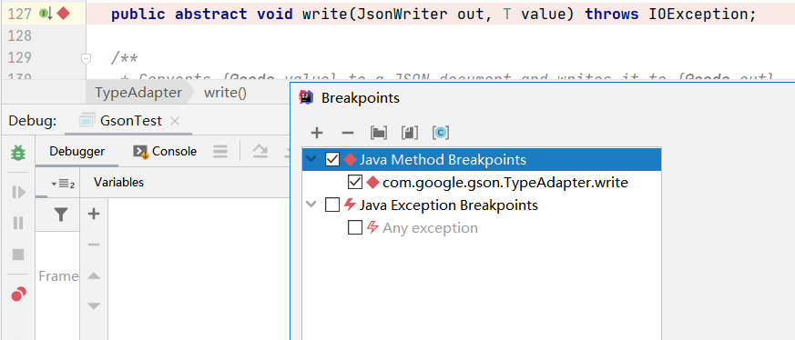

   **当然上面只是一种方法，要是你觉得这种方法比较麻烦，你可以直接按下面的红色小箭头直接进入源码，省去断点在接口的麻烦，但是这样就略去了接口的细节**

   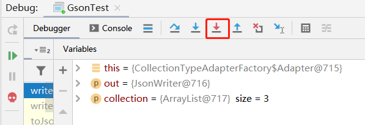

   FAQ：为什么不点蓝色箭头？

   因为蓝色那个有的地方跳不进去

## 2020 years later

1. 根据上面，跳到`ObjectTypeAdapter.java`

   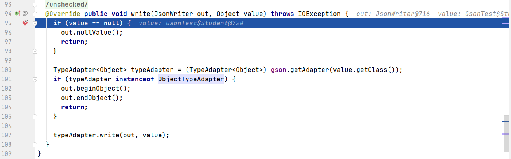

   这时候我们可以判断程序有没有执行 101 行里面的内容，`Step over F8`走下去，发现并没有进去，那么也就说，又到了我们最喜欢的抽象`write`方法环节了，emmm，点进去一如既往：

   

   为了方便，就不调试断点，直接`Step into `进去

2. 进到`ReflectiveTypeAdapterFactory.java`

   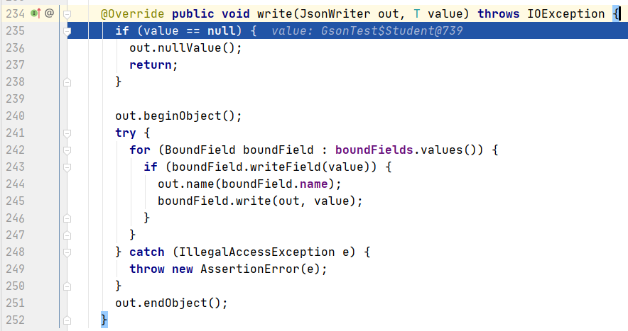

   同样我们需要确定 240 行的作用，先查看现在`out`变量的内容：

   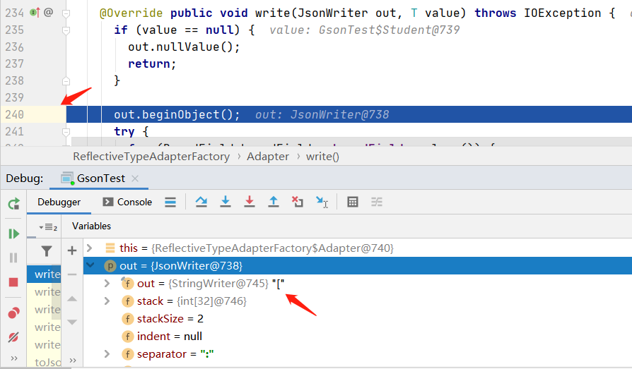

   执行完 240 行后

   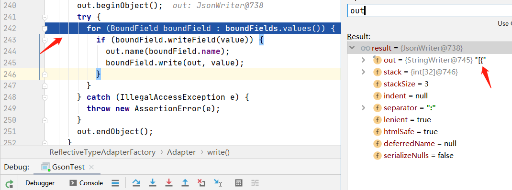

   可以看到 240 行作用只不过是添加个`{`而已，但是绝对不是直接添加`{`那么简单

   自然 251 行作用就是添加个`}`

3. 然后接着`step over`执行到 244 行，为了确定 244 行作用，我们选择的做法依旧是先执行查看结果后再决定要不要`step into`进去。

   这里 244 行并没有什么变化，反而是执行了 245 行后有变化了
   
   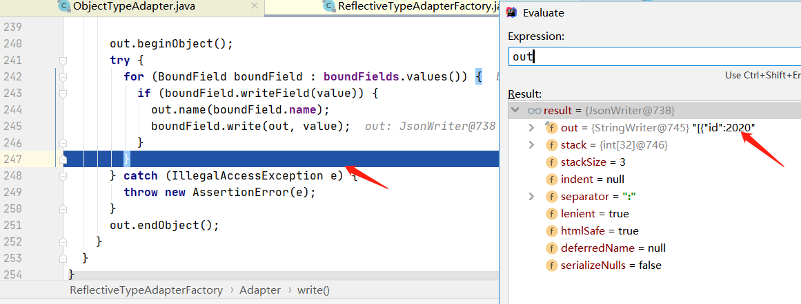

## 找到序列化属性名的代码

1. 进入到 245 行后的代码，位于`ReflectiveTypeAdapterFactory.java`

   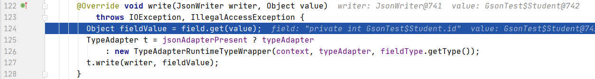

2. 同样为了确定主要代码部分，先让程序执行到 127 行

   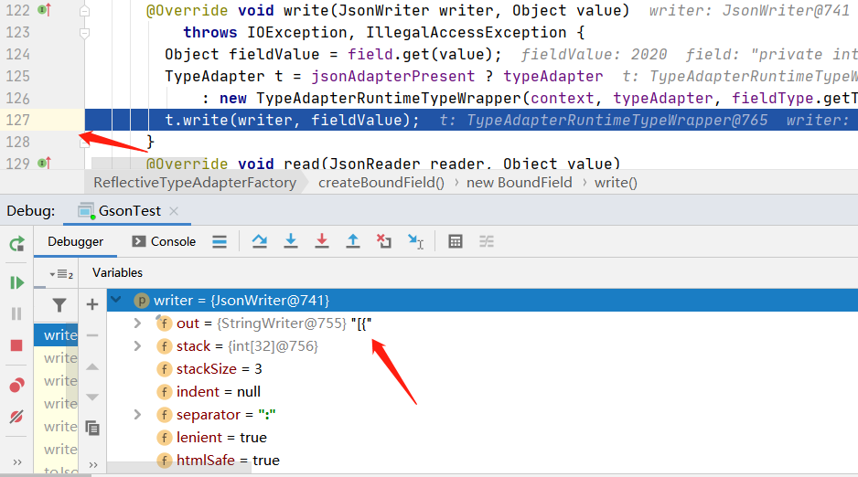

   那么就可以确定是 127 行代码是主要部分，跳进去，又是一次套娃，emmm，这个我们在「找到第三个抽象write方法」那里就有出现过

   

   这里我们选择的是`step over`一步步进行，同时查看`out`方法的变化

   `step over`后，发现程序执行到 69 行` out`变量还没有变化，那么同样使用`step into`进去 69 行后，位于`TypeAdapters.java`，断点调试这行语句

   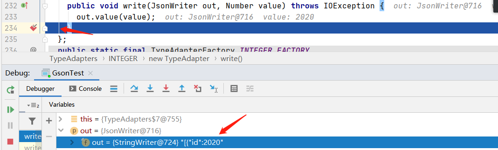

   发现`out`变量内容由`[{`变成了`[{"id":2020`，那么自然得进去看这个代码

3. 调试 233 行，源码进入到`JsonWriter.java`

   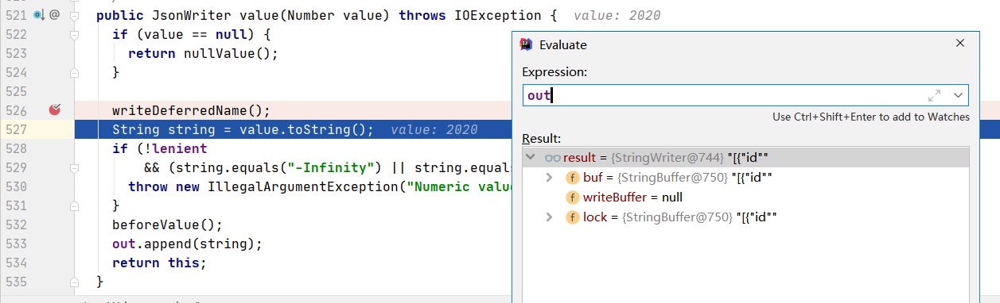

   待执行完 526 行，序列化字符串内容添加了个`"id"`

## 简单分析写入属性名

1. 调试 526 行代码，源码位于`JsonWriter.java`

   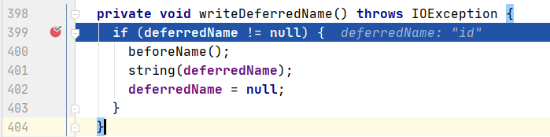

   ​	这里可以看到`defferredName`的值为`id`，那么 401 行代码自然就是将其写入到序列化字符串中

2. 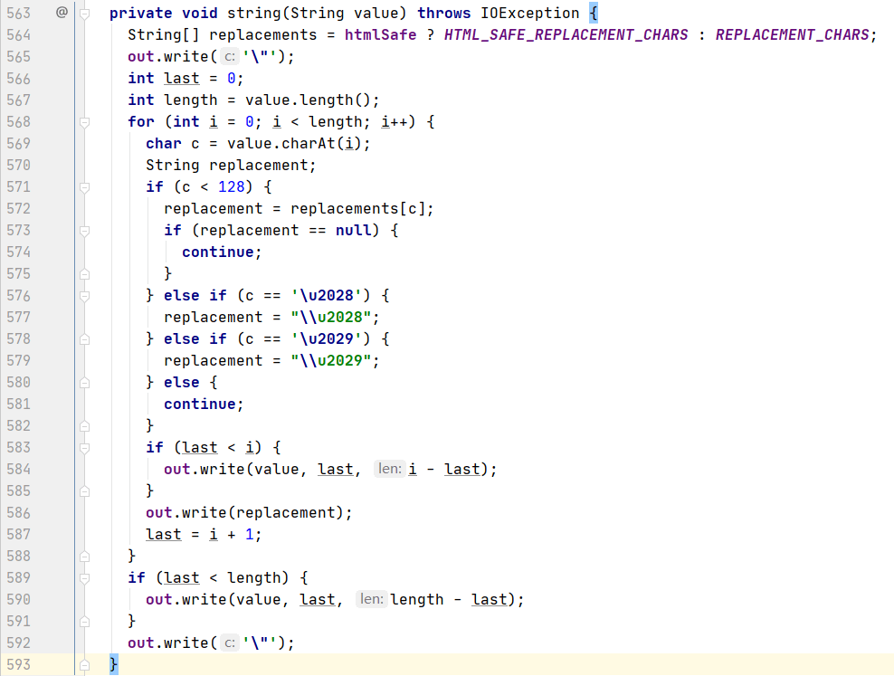

   这里是有做了字符串替换处理，会将一些特殊字符转换为unicode编程格式。

   `replacements`正是一系列代替规则，`htmlSafe`是默认为`true`，替换规则默认如下：

   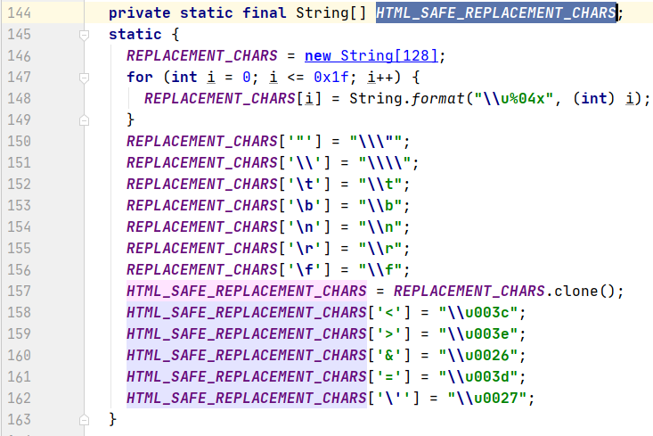

   ​	写入序列化字符串的过程，比如 592 行，使用了`synchronized`进行加锁，`lock`变量是个`Object`的实例

   ​	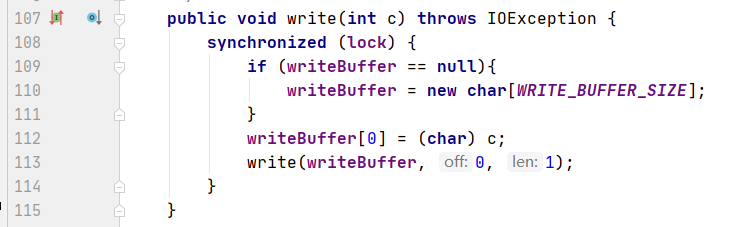

   ​	

### htmlSafe是在哪里置为true的

我们先在原地方`JsonWrite.java`查看`htmlSafe`变量的使用情况

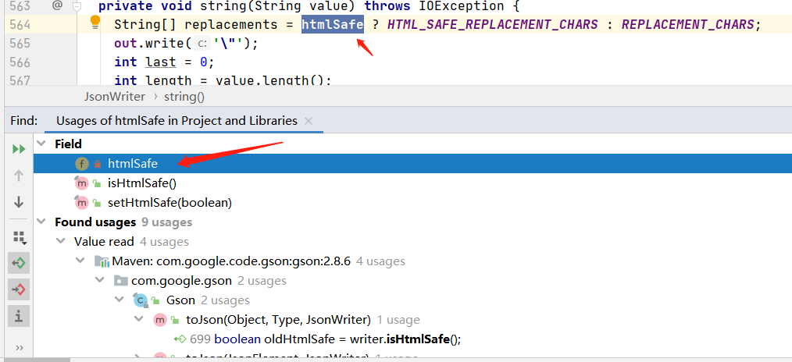

发现有个`htmlSafe`属性，我们把其他的断点情况，将断点断在属性上面，运行debug

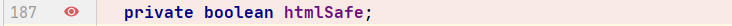

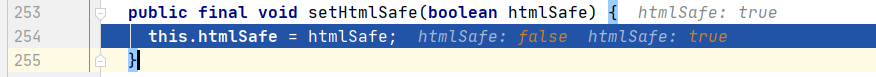

可以看到是有地方调了`setHtmlSafe`方法将其置为true

查看该方法的使用情况，发现在`Gson.java`有地方调用了该方法

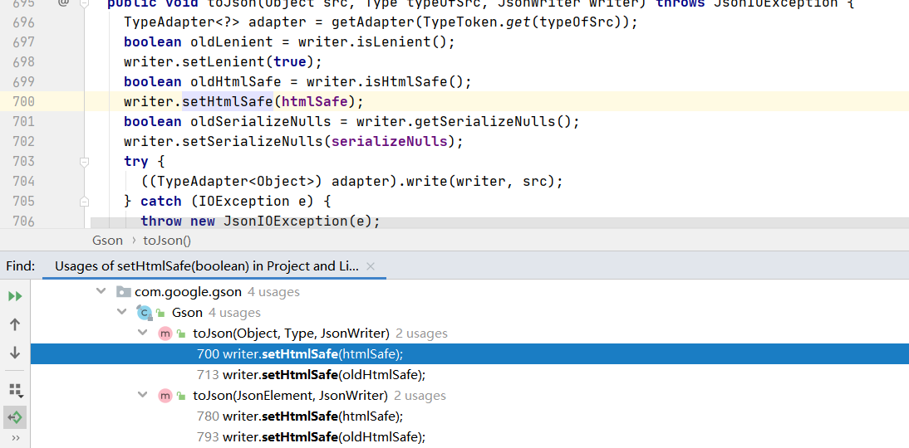

碰巧第 700 行有个`htmlSafe`变量，接着一样是查看该变量使用情况，然后定位到`Gson.java`也有个`htmlSafe`的变量，同样断点该变量

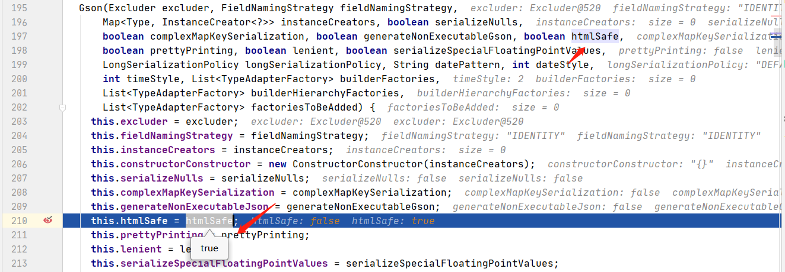

发现这里有个构造函数，给该变量赋值为true，正好是使用默认构造函数创建`Gson`对象的时候会将`htmlSafe`变为true

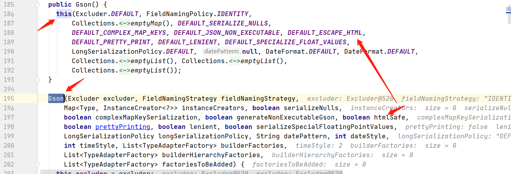

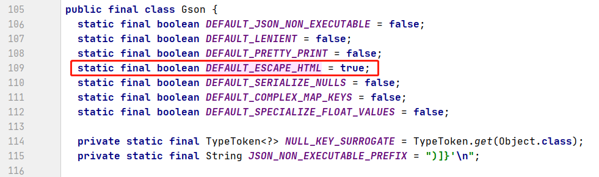

## 找到序列化属性值的代码

上面我们看到，在`JsonWrite.java`里面的 526 行，作用是序列化上属性名，我们接着执行

执行到 532 行代码，这个函数作用是给序列化字符串加个":"

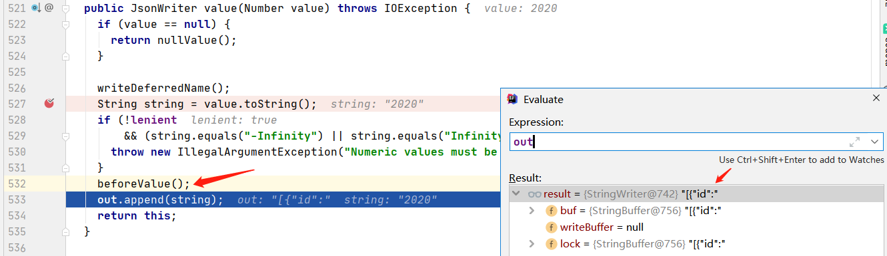

那么，当我们执行玩 533 行时，就已经序列化好了属性名和属性值

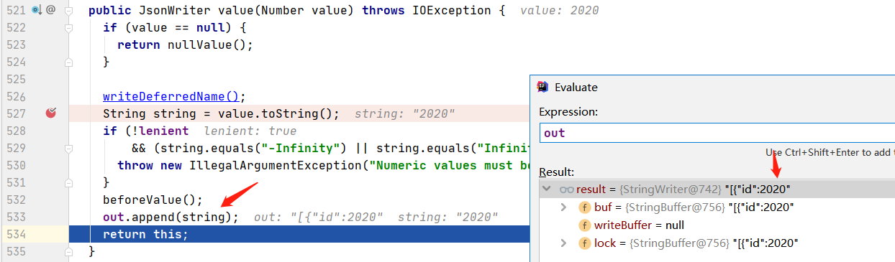

## 是如何获取属性名和属性值的

在上面，我们在 521 行这个函数中得到了一个value值，这个是属性值，但是它是怎么得到的呢

我们可以查看这个函数的调用链：

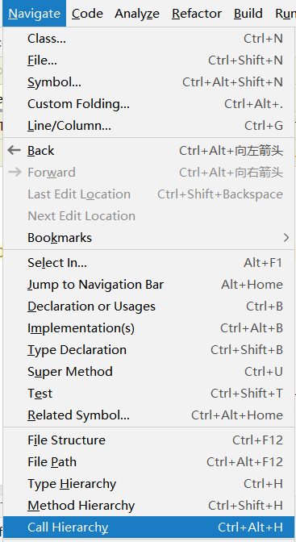

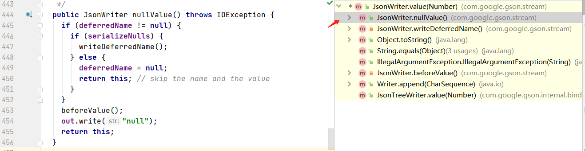

从第一个函数来看，看不到什么

当我们查看第二个函数时，发现有个`deferredName`可疑，于是debug一下，正好这个值就是属性名，那么接下来我们需要得知它是如何被赋值的

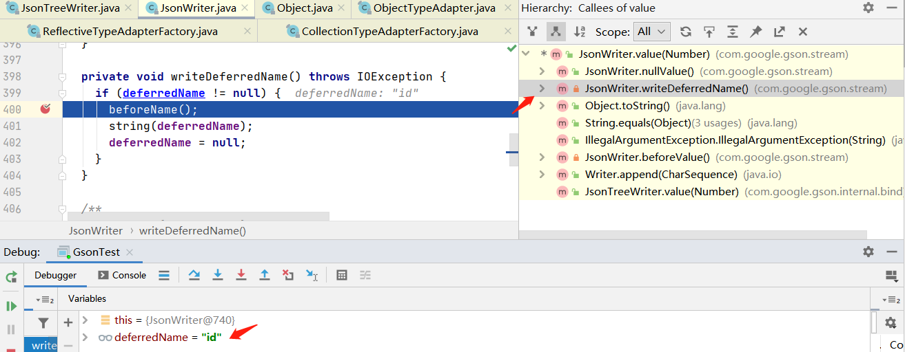

`Find Usages`后，发现是个`JsonWrite`的一个属性，于是我们按照之前的方法给属性断点

然后断点停在了`JsonWriter.java`里

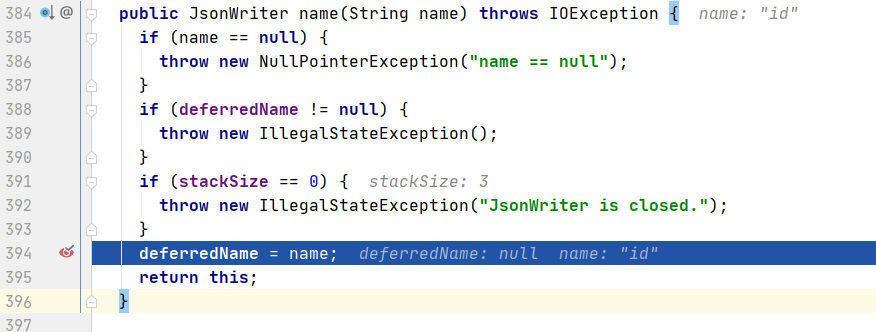

很显然，我们需要知道这个`name`如何来，查看调用链

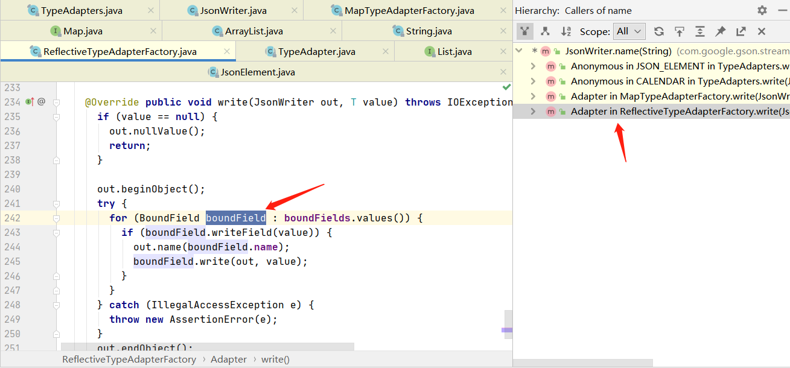

这里找到一个比较可疑的变量`boundField`，位于`ReflectiveTypeAdapterFactory.java`，之所以说是可疑，因为它对比其他的变量特征显著，起码类型不是泛型，而是个具体的。

一看，在 201 行有被用到

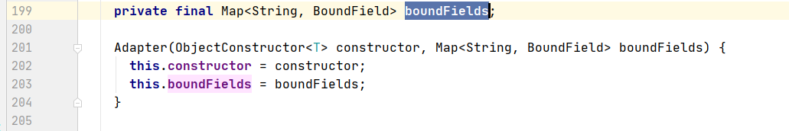

查看 201 行那个函数的使用情况，找到如下

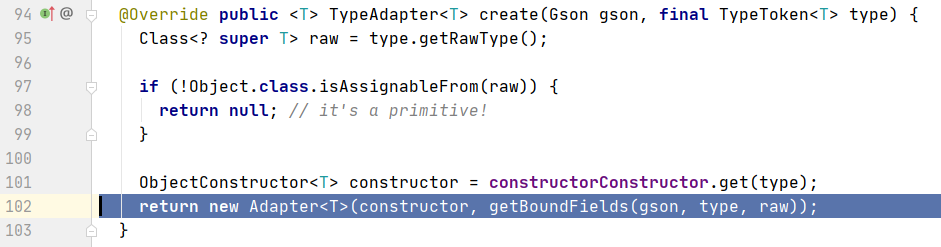

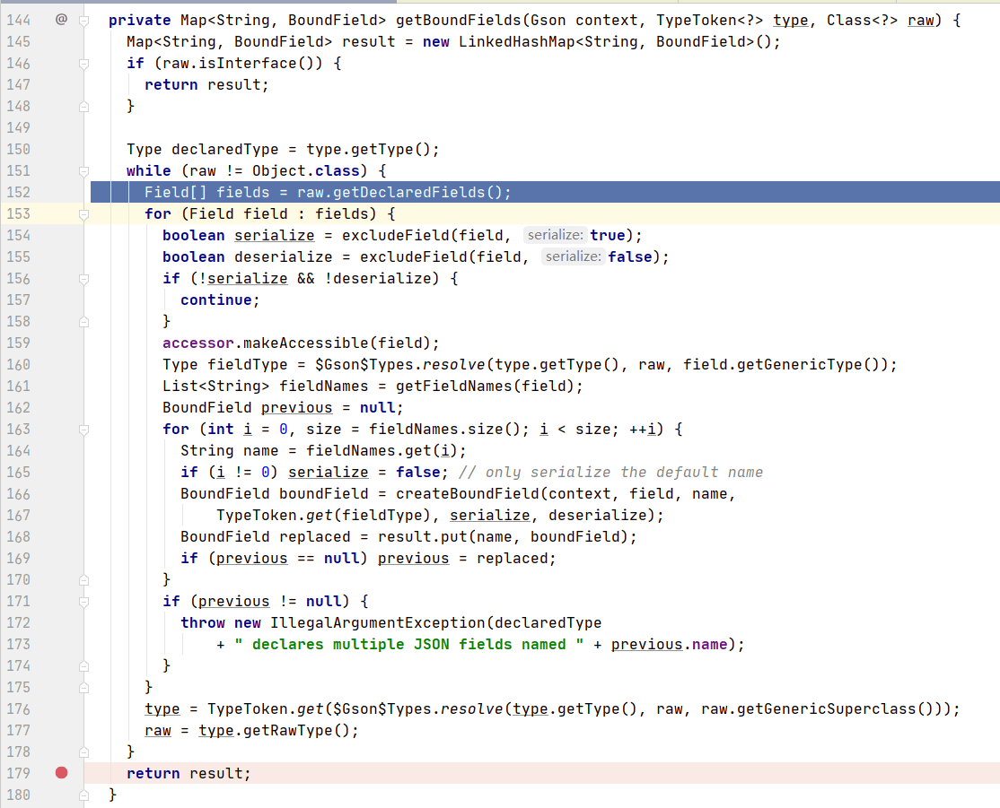

这里看到，有好几处运用到了反射，比如 152 166等行，再结合反射特点，所以推断出应该是用反射获得到属性值和属性名的

# 简单实现

```java
import java.lang.reflect.InvocationTargetException;
import java.lang.reflect.Method;
import java.util.*;

public class Main {
    static class Student{
        private int id;
        private String name;
        private double grade;

        public Student(int id, String name, double grade) {
            this.id = id;
            this.name = name;
            this.grade = grade;
        }

        public int getId() {
            return id;
        }

        public String getName() {
            return name;
        }

        public double getGrade() {
            return grade;
        }
    }

    public static String studentListToJson(List<Student> studentList) throws Exception {
        StringBuilder sb = new StringBuilder();
        //beginArray
        sb.append("[");

        for(int i = 0; i < studentList.size(); i++){
            Student student = studentList.get(i);

            sb.append("{");
            //绑定当前student对象的属性名和值
            Map<String, Object> boundField = new LinkedHashMap<>();

            //获取属性名和值
            Class clazz = student.getClass();
            Field[] fields = clazz.getDeclaredFields();
            for (Field field : fields){
                field.setAccessible(true);
                String fieldName = field.getName();

                String methodName = "get"+fieldName.substring(0,1)
                    .toUpperCase()+fieldName.substring(1);
                Method method = clazz.getMethod(methodName, null);
                Object fieldValue = method.invoke(student, null);
                boundField.put(fieldName, fieldValue);
            }

            boolean[] internalFirst = {true};
            boundField.forEach((k,v) ->{
                if(!internalFirst[0]){
                    sb.append(",");
                }
                sb.append("\"").append(k).append("\"").append(":");
                if(v instanceof Number){
                    sb.append(v);
                }else{
                    sb.append("\"").append(v).append("\"");
                }
                internalFirst[0] = false;
            });

            sb.append("}");
            if(i != studentList.size() - 1){
                sb.append(",");
            }

        }

        //endArray
        sb.append("]");
        return sb.toString();
    }

    public static void main(String[] args) throws Exception {
        List<Student> students = new ArrayList<Student>();
        students.add(new Student(1,"11", 1.11));
        students.add(new Student(2,"22", 2.22));
        students.add(new Student(3,"33", 3.33));
        System.out.println(Main.studentListToJson(students));
    }
}
```

