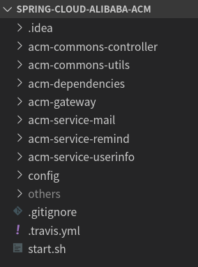
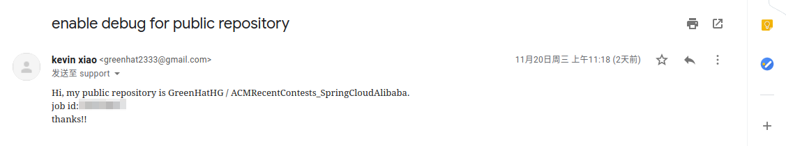
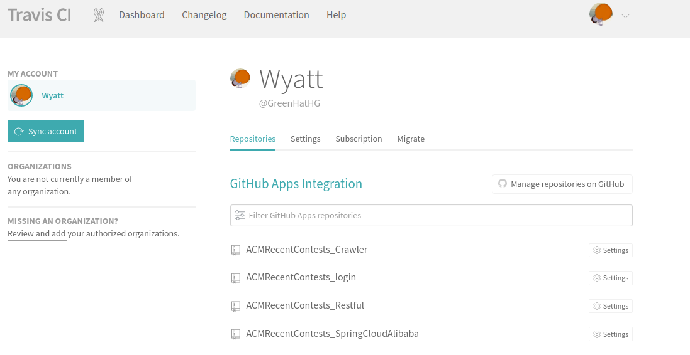
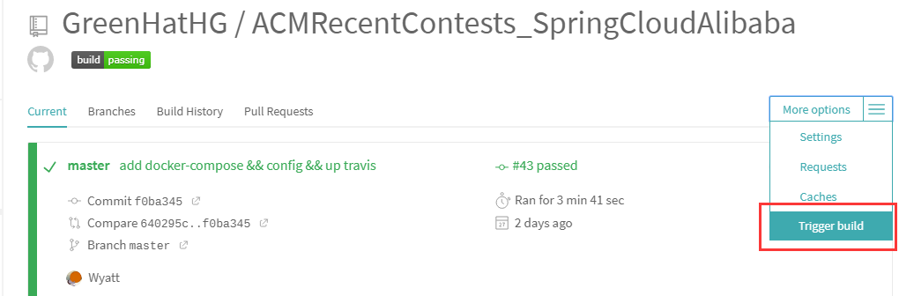

近几个月来水项目有感

<!-- more -->

# SpringBoot转SringCloud

为什么要转？

# SpringCloud自动部署问题

当我们使用`SpringCloud`的时候，意味着我们一个项目会有很多个服务，每个项目都是打包部署的，而我们可能会有几百个服务，所以要是像我们之前使用`SpringBoot`手动打包项目成`Jar`，然后再手动上传到服务器那样的话，那么肯定会累si。所以当我们这个很简单版的`SpringCloud`项目完成后，我就考虑如何去部署它。

既然这么多项目需要打包了，那么直觉就可以告诉我们要上自动部署了，所以这几天一直都在写那个自动部署的脚本。回归正题，其实这东西现在看来是一个`CI/CD`的过程，`CI/CD`又关系到`devops`，之前对这个词有点模糊，现在可以趁机补习一下。

## CI/CD与devops

其实，`CI`的全称是`continuous integration`，`CD`的全称是`continuous delivery`

翻译过来分别是**持续集成**和**持续交付**

那么`devops`呢

> DevOps is a set of practices that combines software development (Dev) and information-technology operations (Ops) which aims to shorten the systems development life cycle and provide continuous delivery with high software quality.
>
> [DevOps - Wikipedia](https://en.wikipedia.org/wiki/DevOps#Definition)

> DevOps（Development和Operations的组合词）是一组过程、方法与系统的统称，用于促进开发（应用程序/软件工程）、技术运营和质量保障（QA）部门之间的沟通、协作与整合。
>
> [devops_百度百科](https://baike.baidu.com/item/devops/2613029)

baba什么的，其实我感觉它的作用应该就是让软件更快更好地交付给客户使用，所以它们的关系应该是

**`CI`与`CD`是`devops`的最佳实践之一，可以更频繁更可靠得交付**

更多可点下面链接了解

[What is CI/CD? Continuous integration and continuous delivery explained | InfoWorld](https://www.infoworld.com/article/3271126/what-is-cicd-continuous-integration-and-continuous-delivery-explained.html)

[如何从零开始搭建 CI/CD 流水线-InfoQ](https://www.infoq.cn/article/WHt0wFMDRrBU-dtkh1Xp)

**总结**

> DevOps 是一种软件开发方法。它将持续开发、持续测试、持续集成、持续部署和持续监控贯穿于软件开发的整个生命周期
>
> CI/CD可以将它们看作是类似于软件开发生命周期的过程

## 搭建CI/CD流水线

搭建`CI/CD`流水线的方法用很多，比如用`Jenkins`，`GitLab`，`Travis`，或者是最近刚出的`Github Actions `等等。之前我们团队尝试过使用`Jenkins`，优点就是自定义任务很多并且可以自己把控，缺点就是得有服务器部署它，（或许是本地虚拟机+内网穿透也行）。

权衡了下，决定使用`Travis`。

------

第一步是在项目的根目录添加`.travis.yml`



这个文件会被`travis`发现，并且执行里面设置的逻辑达到自动部署的目的，其实这个本质上就是`travis`给你开一台机器，你写脚本去控制它，让这个机器帮你做一些事情，这个脚本的内容其实就是`Linux`上的一些命令。`travis`脚本的一些基础的命令可以在网上很容易的找到。

### .travis.yml

下面是我当时写的`.travis.yml`

```bash
language: java

jdk:
  - openjdk8

services:
  - docker

addons:
  apt:
    packages:
    - sshpass

cache:
  directories:
  - $HOME/.m2

install:
  - ssh-keyscan ${gatewayip} >> ~/.ssh/known_hosts

script:
  - bash start.sh acm-dependencies acm-commons-controller acm-commons-utils

branches:
  only:
    - master

notifications:
  email: false

env:
  global:
  - GH_REF=https://github.com/GreenHatHG/ACMRecentContests_SpringCloudAlibaba.git
```

有几点说明一下：

1. 因为Java项目，所以`language`里面是`Java`， `travis`支持多语言，详情可看：[How to set up Travis CI with multiple languages - Stack Overflow](https://stackoverflow.com/questions/27644586/how-to-set-up-travis-ci-with-multiple-languages)，大概是这样的

   ```bash
   matrix:
     include:
       - language: python
         python: 2.7
         script: ...
           ...
       - language: objective-c
         os: osx
         script: ...
          ...
   ```

2. 当前`SpringCloud`项目使用了`maven`构建工具，因为`maven`在构建的时候需要下载很多依赖，所以为了加快构建的速度，我们缓存了`maven`所下载的依赖，当`travis`构建完成时清空其他东西而保存了依赖，下次再次构建的时候就可以直接使用。

   ```bash
   cache:
     directories:
     - $HOME/.m2
   ```


3. 因为要用`sshpass`远程控制服务器，所以得`install`那里把ip地址填到`~/.ssh/known_hosts`文件，以免出现不能访问的情况

### start.sh

因为要执行的逻辑比较多，所以把脚本写到了一个文件里面。`start.sh`:

```bash
#!/bin/bash

# -----------------install父类依赖---------------------
for arg;
do
    mvn clean install -f $arg/pom.xml
done

# -----------------创建dockerfile---------------------
# $1:项目名，$2:jar的相对路径
createDokcerfiler(){
    rm $1/dockerfile || true
    touch $1/dockerfile
    echo 'FROM openjdk:8-alpine' >> $1/dockerfile
    echo 'RUN mkdir /app' >> $1/dockerfile
    echo 'COPY' $2  ' /app/' >> $1/dockerfile
    echo 'CMD java -jar /app/'$2 >> $1/dockerfile
}

# -----------------打包---------------------
baseFolder='/root/spring-cloud-alibaba/'
# 创建文件夹用来存放jar
# sshpass -p $pwd ssh -o StrictHostKeyChecking=no root@$ip 'mkdir -p '${baseFolder} || true

for path in `ls`
do
    flag=1
    # 判断是否是父类依赖，是的话则直接跳过
    for arg;
    do
        if [ $path == $arg ]; then
            flag=0
            break
        fi
    done
    # 判断是不是文件夹
    if [ $flag == 1 ]&&[ -d $path ]; then
        mvn clean package -f $path/pom.xml
        # sshpass -p $pwd scp $path/target/*.jar root@$ip:${baseFolder}
        jarPath=`ls $path/target | grep '.jar$'`
        createDokcerfiler $path $jarPath
        mv "$path/target/$jarPath" $path
    fi
done

# -----------------上传到阿里云docker仓库---------------------
time=$(date "+%Y%m%d%H")

docker login --username=$registryu registry.cn-hongkong.aliyuncs.com --password=$registryp

for path in `ls`
do
    if [ -f $path/dockerfile ]; then
        docker build -t $path:$time $path
        docker tag $path:$time registry.cn-hongkong.aliyuncs.com/acm-recentcontests/$path:$time
        docker push registry.cn-hongkong.aliyuncs.com/acm-recentcontests/$path:$time
    fi 
done
```

里面执行的逻辑其实很简单，**首先就是对`maven`所要依赖的公共项目进行编译安装，然后再去编译其他独立的一个个项目，最后制作`dockerfile`文件，编译打包上传到阿里云的`docker`仓库**。

这里面有几个坑点，一个是多模块的`maven`项目怎么打包，这里面也花了我挺长时间，因为每个项目都是独立的，不像单体应用那么简单。除了我这个方法，还有一个方法就是构建一个`maven`私服，把自己的`jar`包上传上去，当构建别的项目的时候，它依赖了某个项目，这时候所要依赖的`jar`包可以从私服上面找到。

第二点就是`dockerfile`要和`jar`文件夹处在同一级目录才好打包，不然会报错，所以脚本有一处是将`jar`包移动到`dockerfile`的目录

第三点就是一些零零碎碎的`Linux Shell`知识了，比如赋值等号不能有空格，双引号与单引号的区别等等，需要注意。

### debug模式

不过这里有个好方法可以去解决脚本问题，就是开启`debug`模式，这样我们可以`ssh`到`travis`的机器上面，然后我们可以在`travis`里面不断修改我们的脚本。

[Running Build in Debug Mode - Travis CI](https://docs.travis-ci.com/user/running-build-in-debug-mode/)

跟着官网的脚本走就行了，不过需要注意几点就是

1. 需要给官方发邮件叫工作人员对你的某个配置开启`debug`模式后你才能用这个模式，注意时区2333，那时候工作人员可能还在睡觉



2. 因为`travis`服务器处于外国，直接连接会比较慢，所以可以考虑给`ssh`套代理，在`linux`使用`ssh`命令`我`并没有找到什么的好的让`ssh`走代理的方法，我是用`putty`解决的
3. `ssh`上去后如果执行`exit`的话会直接导致这次的`debug`直接结束，如果需要退出，直接关闭窗口就行，下次连接的时候还是处于上次操作的位置，需要注意的是，一次`debug`模式只有三十分钟，超时了只能再发一次请求，并且数据会清空。

### travis网页的设置

脚本配置好了后，就可以去`travis`[官网](https://travis-ci.com/)设置要关联的仓库，好像现在`travis`只能关联`Github`仓库，并且得是公开的，私有仓库得要钱。

然后在右上角头像那里打开`setting`，进去之后就有个`repositories`



记得之前官网是`travis.org`的时候有关联的设置，新版官方好像是没有，我们直接在我们要自动部署的仓库里面点一次构建，之后就可以一直构建了。



然后查看每次的构建日志就行啦。

### 总结

总结来说，一共2步：

1. **编写`.travis.yml`文件放到项目根目录并且推上仓库**
2. **在`travis`官网设置要关联的仓库**

## 个人总结

个人踩过的坑在`maven`的构建和`travis`脚本的编写上面，因为那时候在整一个项目下新建一个子项目都是手动的，有时候会打错某个文件夹名字，**但是`idea`可以运行，命令行打包会报错，这时候可能是某个文件夹的名字错了，或者是某个文件的名字错了，**所以手残党新建一个`SpringBoot`子项目的时候可以新建一个`maven`的`module`，然后删除多余的东西就行啦。

还有一个就是`pom.xml`找不到父模块的问题，或者托管这个`maven`子项目到`idea`的时候会报错，这时候**只需要把`idea2019`版本换回`idea2018.2`**就行啦。

这2个前期最烦的问题，解决就顺畅很多了。