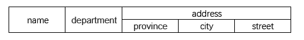
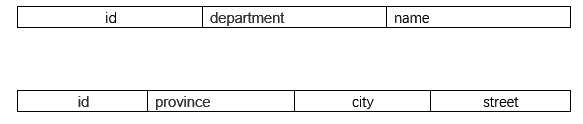
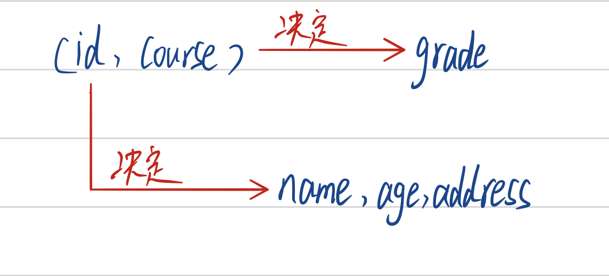
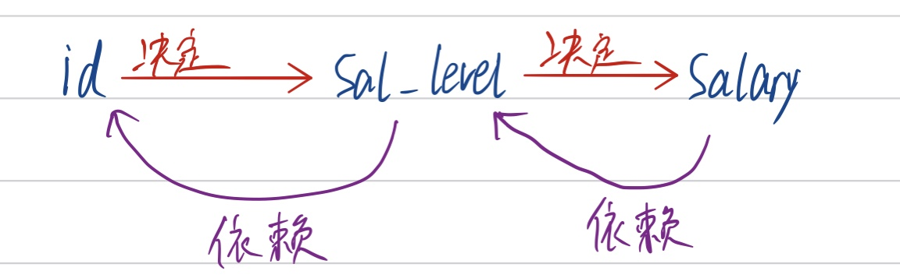

# 1NF

*在任何一个关系数据库中，第一范式（1NF）是对关系模式的基本要求，不满足第一范式（1NF）的数据库就不是关系数据库。*

第一范式是指数据库表的每一列都是不可分割的基本数据项，同一列中不能有多个值，**即每一个属性都是原子的，不能再分，也可以理解为不能表中套表**。

---

如下人员基本信息表：

这样的表是不能创建的，我们可以把这个表拆为基本信息表和地址表，通过人员编号来建立联系

或者是

# 2NF

第二范式是在第一范式基础上面提出来的，也就是说满足第二范式意味同时满足了第一范式。

第二范式：一张表中每个属性都是原子的，**并且不存在对主键的部分函数依赖**。（部分函数依赖比较晦涩，看例子好懂）

---

下面是学生信息表，最后两项为课程号和该门课成绩

在这张表里面学号是主键吗？**学号不是主键，学号能决定姓名，年龄，地址，但是凭学号这一项，是决定不了成绩这一项，所以这里学号不是主键。**

**所以这张表的主键是（学号，课程号）**

凭（学号，课程号）可以决定成绩；但是凭学号就可以决定姓名，年龄和地址，不需要课程号。

**所以在这里尽管主键是（学号，课程号），但是姓名，年龄和地址只要学号就可以决定的，也就是说这三个属性对主键存在部分函数依赖，它只依赖于主键里面的学号这一项，只依赖于主键的一部分，所以不是第二范式。**

简单地说，第二范式要求每个非主属性完全依赖于主键，而不是仅依赖于其中一部分属性。

## 不满足2NF问题

### 插入异常

如计划开新课，由于没人选修，没有课程号信息，那么因为（学号，课程号）是主键，所以连学生基本信息也不能插入，只有学生选课之后，才能插入信息。

### 删除异常

若学生申请病假休学一学期，从当前数据库删除选修记录，那么学生的基本信息也就丢了。

### 数据冗余

假设一个学生选修50门课，那么学生基本信息就重复了很多次，造成数据冗余。

### 更新异常

难以维护一致性，因为存在数据冗余，可能更改的时候漏掉了哪条记录

## 解决方法

拆分成两个表，学生基本信息表和选课成绩表

总的来说，**一张表只管一件事情**，就不会出现这种问题。

# 3NF

在2NF基础上，不存在属性对主键的**传递依赖**。看下面例子：

有一员工信息表，属性分别是员工号，工资级别，工资

这张表的主键是员工号，一旦员工号确定了，工资级别也确定了，那么工资也就确定了。

**但是工资对员工号存在传递依赖**

具体看下图

## 3NF问题

### 插入异常

当工资级别还没有确定的时候，工资就无法确定。

### 删除异常

假设只有一个员工拿三级工资，当这个员工不在这个公司的时候，数据被删掉，那么这个工资级别与工资的对照关系就不存在了。

### 数据冗余

同2NF，工资级别与工资信息大量重复

### 更新异常

同2NF，难以维护一致性

## 解决问题

同2NF，拆表，一张表只维护一件事。

---

参考：

[第一范式_百度百科](https://baike.baidu.com/item/1NF)

[第二范式_百度百科]([https://baike.baidu.com/item/%E7%AC%AC%E4%BA%8C%E8%8C%83%E5%BC%8F](https://baike.baidu.com/item/第二范式))

[第三范式_百度百科]([https://baike.baidu.com/item/%E7%AC%AC%E4%B8%89%E8%8C%83%E5%BC%8F](https://baike.baidu.com/item/第三范式))