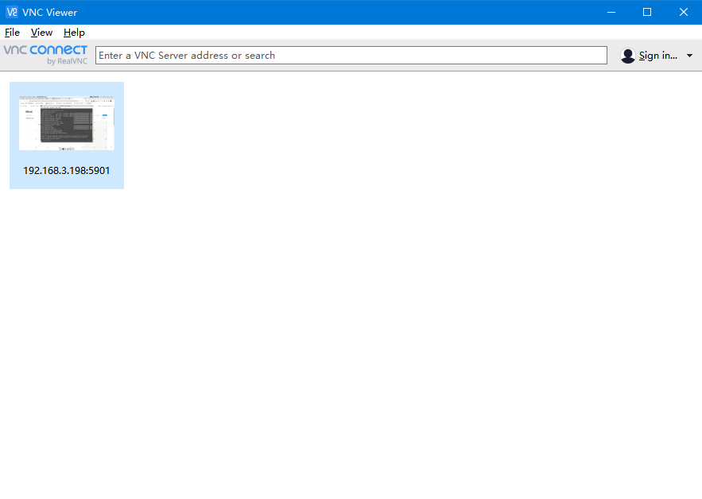
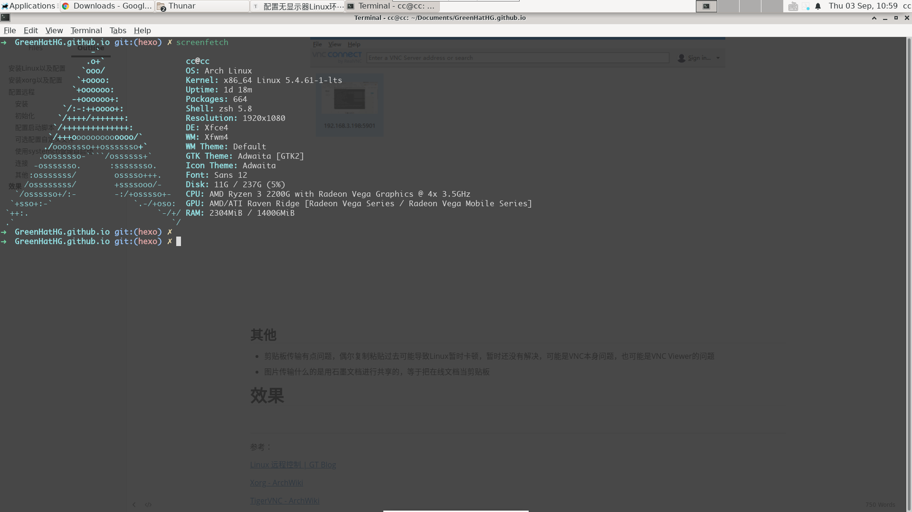

使用Windows内网远程Linux用于开发，让Linux专注于开发

<!-- more -->

# 安装Linux以及配置

本次安装的是Arch，具体教程略过，可参考

[Arch安装配置笔记 - GreenHatHGのBlog](https://greenhathg.github.io/2019/02/15/Arch%E5%AE%89%E8%A3%85%E9%85%8D%E7%BD%AE%E7%AC%94%E8%AE%B0/)

# 安装xorg以及配置

- 安装xorg

  ```shell
  pacman -S xorg-server xorg-xinit
  ```

- 无显示器配置还需要安装

  ```shell
  pacman -S xf86-video-dummy
  ```

- 正常来说，新版xorg能够自动配置，但是对于无显示器方案，我们需要自己添加配置文件

  ```shell
  /etc/X11/xorg.conf.d/10-headless.conf
  
  Section "Monitor"
          Identifier "dummy_monitor"
          HorizSync 28.0-80.0
          VertRefresh 48.0-75.0
          Modeline "1920x1080" 172.80 1920 2040 2248 2576 1080 1081 1084 1118
  EndSection
  
  Section "Device"
          Identifier "dummy_card"
          VideoRam 256000
          Driver "dummy"
  EndSection
  
  Section "Screen"
          Identifier "dummy_screen"
          Device "dummy_card"
          Monitor "dummy_monitor"
          SubSection "Display"
          EndSubSection
  EndSection
  ```

  如此，就能够在远程中直接显示图像页面，但是有个注意点，插入显示器后不会出现任何内容，如果需要可以去掉配置

# 配置远程

使用过两种常见的方案，一种是Teamviewer，另外一种是TigerVNC

- Teamviewer
  - 好处在于不需要配置什么，直接安装完就能够使用，剪贴板传输文件传输，外网连接什么的方便
  - 不足之处在于内网连接可能速度不如VNC快，而且Linux版本自启什么的可能有问题
- TigerVNC
  - 好处在于内网内传输比较快，出问题比较少
  - 不足之处在于配置略麻烦，剪贴板传输有点问题，比如中文乱码，传输不成功卡顿，外网使用需要内网穿透
  - 这里选择的是VNC

## 安装

```shell
pacman -S tigervnc 
```

## 初始化

```shell
vncserver
```

`:1`实际上是TCP端口5901（5900 + 1）

## 配置启动脚本

```shell
~/.vnc/xstartup

#!/bin/sh
unset SESSION_MANAGER
unset DBUS_SESSION_BUS_ADDRESS
exec startxfce4
```

这里是xfce DE，其他的可以看ArchWiki

## 可选配置自定义文件

```shell
~/.vnc/config

## Supported server options to pass to vncserver upon invocation can be listed
## in this file. See the following manpages for more: vncserver(1) Xvnc(1).
## Several common ones are shown below. Uncomment and modify to your liking.
##
#securitytypes=vncauth,tlsvnc
#desktop=sandbox
geometry=1920x1080
dpi=130
#localhost
#alwaysshared
```

## 使用systemctl管理自启动

```shell
/usr/lib/systemd/system/vncserver@:1.service

[Unit]
Description=Remote desktop service (VNC)
After=syslog.target network.target

[Service]
Type=forking
User=cc
WorkingDirectory=/home/cc
ExecStartPre=/bin/sh -c '/usr/bin/vncserver -kill %i > /dev/null 2>&1 || :'
ExecStart=/usr/bin/vncserver %i -geometry 1440x900 -alwaysshared
ExecStop=/usr/bin/vncserver -kill %i

[Install]
WantedBy=multi-user.target
```

## 连接

Windows上可以使用VNC Viewer连接



## 其他

- 剪贴板传输有点问题，偶尔复制粘贴过去可能导致Linux暂时卡顿，暂时还没有解决，可能是VNC本身问题，也可能是VNC Viewer的问题
- 图片传输什么的是用石墨文档进行共享的，等于把在线文档当剪贴板

# 效果

开启全屏下效果挺好



休眠状态下可以仿MAC当时钟，安装在aur的gluqlo，然后在ScreenSaver里面配置就行

```shell
yay -S gluqlo
```


---

参考：

[Linux 远程控制 | GT Blog](https://htmlgtmk.github.io/blog/2019/10/18/Linux-%E8%BF%9C%E7%A8%8B%E6%8E%A7%E5%88%B6/)

[Xorg - ArchWiki](https://wiki.archlinux.org/index.php/Xorg)

[TigerVNC - ArchWiki](https://wiki.archlinux.org/index.php/TigerVNC)